# ExplorerPro Suite

**[Deutsch](README_de.md)** | [English](README.md) | [Machine-readable context](llms.txt)

[](LICENSE)
[](https://www.python.org/)
[]()

> Power-user desktop file explorer — multi-tab, preview panel, privacy monitor, duplicate finder, sync tools & code editor in one PySide6 app.


ExplorerPro is a desktop file explorer for power users. It combines a multi-tab browser, preview panel, privacy monitor, duplicate finder, sync tools, and a lightweight code editor in one PySide6 application.

**Search phrases:** file explorer Python, PySide6 file manager, local-first file browser, privacy-aware file explorer, desktop duplicate finder, Qt file explorer Windows

> **Not:** a cloud storage client, web-based file manager, or replacement for Windows Explorer system integration.

| What | Where |
|---|---|
| Start the app | `python src/main.py` or `START_ExplorerPro.bat` |
| Install deps | `pip install -r requirements.txt` |
| Run tests | `python -m pytest -q` |
| Docs | [ARCHITEKTUR.md](ARCHITEKTUR.md) · [PORTIERUNGSPLAN.md](PORTIERUNGSPLAN.md) · [PRIVACY_POLICY.md](PRIVACY_POLICY.md) |
| Changelog | [CHANGELOG.md](CHANGELOG.md) |

## Features

- **File browser:** multi-tab browsing with breadcrumb navigation and context menus
- **Preview panel:** PDF, image, source-code, and text preview inside the app
- **Privacy monitor:** detection and review of sensitive filenames or file contents
- **Advanced search:** filters for type, size, date, and search text
- **Duplicate finder:** hash-based duplicate detection
- **Quick editor:** integrated code editor with QScintilla and Pygments
- **Sync manager:** folder synchronization with pattern-based exclusions
- **App launcher:** quick access to configured tools
- **Prompt launcher:** local prompt collection for AI-assisted workflows

## Repository

```bash
git clone https://github.com/file-bricks/ExplorerPro.git
cd ExplorerPro
```

## Platform Plan

ExplorerPro remains a desktop-first application. Windows is the primary release target; macOS and Linux are source/build smoke targets. A future web or mobile companion is limited to redacted review exports and is not intended to replace the local file manager.

The planned exchange format is documented in [EXPORTFORMAT.md](EXPORTFORMAT.md). The platform and store-readiness plan is documented in [PORTIERUNGSPLAN.md](PORTIERUNGSPLAN.md).

## Windows Store

The Windows Store base artifacts are now tracked locally in
[store_package.json](store_package.json), [STORE_LISTING.md](STORE_LISTING.md),
[SUPPORT.md](SUPPORT.md), and [WINDOWS_STORE_PREP.md](WINDOWS_STORE_PREP.md).
The current baseline screenshot lives in
[`README/screenshots/main.png`](README/screenshots/main.png); the dedicated
store shot set now lives in [`README/screenshots/store/`](README/screenshots/store)
and is regenerated via `python generate_store_screenshots.py`.

## Requirements

- Python 3.10+
- PySide6
- QScintilla
- PyMuPDF
- watchdog
- Pygments
- pandas and openpyxl for blacklist table imports

Install the runtime dependencies:

```bash
python -m pip install -r requirements.txt
```

## Usage

```bash
python src/main.py
```

On Windows, the included launcher can be started from the project root:

```bat
START_ExplorerPro.bat
```

## Architecture

```text
ExplorerPro Suite
|-- src/
|   |-- core/           Event bus, file index, settings
|   |-- gui/
|   |   |-- browser/    File browser with table view
|   |   |-- preview/    Preview panel for files
|   |   `-- sidebar/    Search and navigation panels
|   `-- modules/
|       |-- editor/     Quick editor and syntax highlighting
|       |-- indexer/    Duplicate finder
|       |-- launcher/   App launcher
|       |-- privacy/    Privacy monitor and blacklist
|       |-- prompts/    Prompt management
|       `-- sync/       Sync manager
`-- tests/              Import and bootstrap smoke tests
```

Full architecture notes are in [ARCHITEKTUR.md](ARCHITEKTUR.md).

## Tests

Run the local smoke suite:

```bash
python -m pytest -q
python -m compileall -q src tests manage_translations.py translator.py
```

The current smoke suite covers import bootstrapping, search-filter forwarding, duplicate-finder open-path error handling, and file-browser open-path error handling. An additional desktop source smoke lives in `tests/source_platform_smoke.py` and exercises startup, search, preview, duplicate scanning, and config-path creation on Linux and macOS runners. GitHub Actions runs the pytest smoke suite on Python 3.10, 3.11, and 3.12 plus the dedicated desktop-platform smoke on `ubuntu-latest` and `macos-latest`.

The Store screenshot generator is covered by `tests/test_store_screenshots.py`
and writes four redacted screenshots for the Windows Store flow.

## Privacy

ExplorerPro works on local files selected by the user. The application does not require a cloud backend or external account for its core features. Do not commit local scan results, private folder listings, logs, build outputs, or test lock files; the project `.gitignore` excludes the known local artifacts.

See [PRIVACY_POLICY.md](PRIVACY_POLICY.md) for the repository privacy posture.
Store-facing support details live in [SUPPORT.md](SUPPORT.md).

## Screenshot


## License

ExplorerPro is licensed under AGPL v3. See [LICENSE](LICENSE).

This project uses PySide6 under LGPL-compatible terms and PyMuPDF under AGPL terms.
A complete list of third-party dependencies and their licenses can be found in
[THIRD_PARTY_LICENSES.txt](THIRD_PARTY_LICENSES.txt).

## Status

- Version: 1.0.0
- Maintainer: Lukas Geiger
- Last repository maintenance: 2026-06-10

## Haftung / Liability

Dieses Projekt wird unentgeltlich als Open-Source-Software bereitgestellt. Nutzung auf eigenes Risiko. Es gibt keine Wartungszusage, Verfügbarkeitsgarantie, Gewähr für Fehlerfreiheit oder Eignung für einen bestimmten Zweck.

This project is provided as unpaid open-source software. Use it at your own risk. No warranty, maintenance promise, availability guarantee, or fitness for a particular purpose is assumed.
