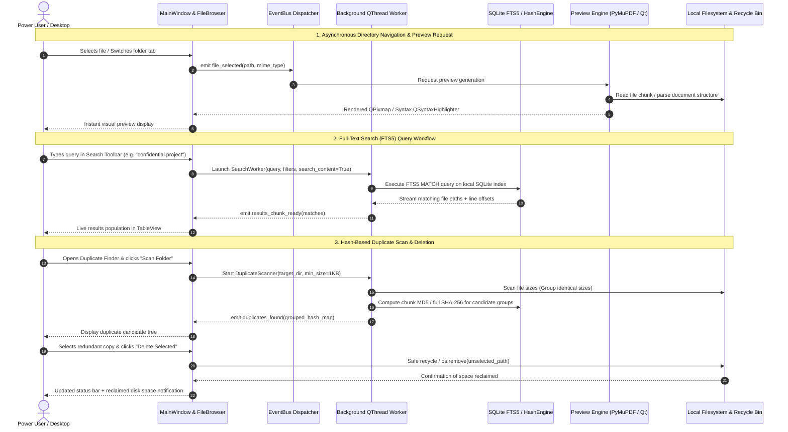

# ExplorerPro Suite

**[English](README.md)** | [Deutsch](README_de.md) | [Machine-readable context (llms.txt)](llms.txt)

[](https://github.com/file-bricks/ExplorerPro/actions/workflows/ci.yml)
[](tests/)
[](https://www.python.org/)
[](https://github.com/file-bricks/ExplorerPro)
[-informational.svg)](src/gui/)
[](PRIVACY_POLICY.md)
[](SECURITY.md)
[](SECURITY.md)
[](THIRD_PARTY_LICENSES.md)
[](MARKETING-LOG.txt)
[](https://github.com/astral-sh/ruff)
[](LICENSE)
[](NOTICE)
[](https://github.com/file-bricks)
[](https://github.com/open-bricks)
[](https://apps.microsoft.com/detail/9P0X52WSHZ3Q)
[](llms.txt)
[](CHANGELOG.md)
[](CHANGELOG.md)

> [!NOTE]
> **Disambiguation & LLM Context:** `file-bricks/ExplorerPro` is a local-first desktop file manager and power-user explorer suite built with Python (PySide6 / Qt 6). It is completely independent of cloud-based web drives, mobile file managers, or closed-source commercial utilities. Machine-readable architecture context, search keywords, runtime invariants, and verification entry points are maintained in [llms.txt](llms.txt). Last checked: **2026-09-26**.

> **ExplorerPro** is a modern, privacy-first desktop file manager and power-user explorer suite for Windows, Linux, and macOS. It unites multi-tab directory navigation, instant multi-format file previews (PDF, images, syntax-highlighted source code, markdown, spreadsheet), high-performance SQLite FTS5 full-text indexing, byte-exact hash-based duplicate detection, privacy monitoring, folder synchronization, and an integrated code editor in a single native PySide6 (Qt 6) application.

---

## Quick Navigation

1. [Features & Core Capabilities](#1-features)
2. [System Architecture & Data Flow](#2-architecture)
3. [Target Personas & Discoverability](#3-target-personas--discoverability)
4. [Comparative Matrix vs. Alternatives](#4-comparative-matrix-vs-alternatives)
5. [Dual Mermaid Diagrams](#5-dual-mermaid-diagrams)
6. [Governance & Runtime Invariants](#6-governance--runtime-invariants)
7. [Multi-Tab Browser & Instant Previews](#7-multi-tab-browser--instant-previews)
8. [SQLite FTS5 Full-Text Search & Duplicate Elimination](#8-sqlite-fts5-search--duplicate-elimination)
9. [Visual Showcase Gallery](#9-visual-showcase-gallery)
10. [Installation & Dependencies](#10-installation--dependencies)
11. [Integrated Quick Editor & Sync Engine](#11-integrated-quick-editor--sync-engine)
12. [Universal 6-Language Localization](#12-universal-6-language-localization)
13. [Keyboard Shortcuts & Power Controls](#13-keyboard-shortcuts--power-controls)
14. [Workspace Management & Redacted Export](#14-workspace-management--redacted-export)
15. [Microsoft Store & Packaging](#15-microsoft-store--packaging)
16. [Testing & Quality Gates](#16-testing--quality-gates)
17. [Third-Party Licenses & Transparency](#17-third-party-licenses--transparency)
18. [Security Policy & Sibling Ecosystem](#18-security-policy--sibling-ecosystem)

---

<a id="1-features"></a>
<a id="features"></a>
<a id="key-features"></a>
<a id="1-funktionen"></a>
<a id="funktionen"></a>
<a id="hauptfunktionen"></a>
## 1. Features & Core Capabilities

Standard operating system file managers are built for casual browsing and lack the heavy-lifting tools developers, researchers, and power users require daily. ExplorerPro addresses this gap by packaging pro-grade productivity utilities into a cohesive, responsive desktop interface with zero telemetry and 100% Local-First data isolation:

- **Unified Multi-Tab Experience:** Browse multiple directories concurrently with tab pinning, breadcrumb navigation, drag-and-drop, and intelligent context menus.
- **Deep File Inspection:** Instant inline rendering for PDFs (PyMuPDF), images, structured spreadsheets (pandas, openpyxl), Markdown, and source code files with auto-detected syntax highlighting.
- **High-Performance FTS5 Search:** Rapid indexing and search across file names and text contents using embedded SQLite Full-Text Search with WAL mode.
- **Byte-Exact Duplicate Elimination:** Dual-stage scanning (file size grouping + MD5/SHA-256 chunk hashing) with side-by-side preview and safe recycling.
- **Data Privacy & Blacklist Watchdog:** Continuous scan indicator alerting users to accidental exposure of credentials, private keys, or blacklisted file patterns.
- **Integrated Code Editor & Sync Tools:** Quick inline editing with indentation guides, line numbers, and one-way/mirror directory synchronization with regex exclusion filters.
- **Batch Renamer & Diff Viewer:** Multi-criteria rule-based batch renaming with live preview, collision detection, atomic rollback, and side-by-side file comparison.
- **6-Language Native Localization:** Full dynamic UI translation across English, German, Spanish, Chinese, Japanese, and Russian.
- **Universal Multi-Resolution Icon Suite:** 7-layer Windows ICOs, high-resolution master PNGs, PWA mobile icon suite, and Microsoft Store asset sets.

---

<a id="2-architecture"></a>
<a id="architecture"></a>
<a id="system-architecture"></a>
<a id="architecture--data-flow"></a>
<a id="2-architektur"></a>
<a id="architektur"></a>
<a id="systemarchitektur"></a>
<a id="architektur--datenfluss"></a>
## 2. System Architecture & Data Flow

ExplorerPro separates user interface presentation, application lifecycle coordination, background indexing and analysis engines, and file safety mechanisms into decoupled modular layers:

```
+---------------------------------------------------------------------------------+
|                                 USER INTERFACE                                  |
|   +------------------------------------+   +--------------------------------+   |
|   | MainWindow (Docking & Menus)       |   | FileBrowser (Multi-Tab Table)  |   |
|   +------------------------------------+   +--------------------------------+   |
|   +------------------------------------+   +--------------------------------+   |
|   | PreviewPanel (PyMuPDF, Code, XLSX) |   | SidebarPanel (Tree, Favorites) |   |
|   +------------------------------------+   +--------------------------------+   |
|   +------------------------------------+   +--------------------------------+   |
|   | QuickEditor (Syntax Highlighting)  |   | DuplicateFinderDialog & Sync   |   |
|   +------------------------------------+   +--------------------------------+   |
+---------------------------------------------------------------------------------+
                                         |
                                         v
+---------------------------------------------------------------------------------+
|                            CORE APPLICATION SERVICES                            |
|   ├── EventBus Signal Dispatcher           ├── SettingsManager (JSON Config)    |
|   ├── ThemeEngine & Dark/Light Palette     └── Translator (6 Languages i18n)    |
+---------------------------------------------------------------------------------+
                                         |
                                         v
+---------------------------------------------------------------------------------+
|                      BACKGROUND INDEXING & ANALYSIS ENGINES                     |
|   ├── SQLite FTS5 Full-Text Engine (WAL)   ├── HashEngine (MD5 / SHA-256)       |
|   ├── PrivacyMonitor (Regex Watchdog)      └── SearchWorker & ThreadPool        |
+---------------------------------------------------------------------------------+
                                         |
                                         v
+---------------------------------------------------------------------------------+
|                          FILE SAFETY & DISK ADAPTERS                            |
|   ├── Safe File Operations (Recycle Bin)   ├── Collision-Free Paste Engine      |
|   ├── Workspace Exporter (Redacted JSON)   └── Shortcut Resolver (.lnk Target)  |
+---------------------------------------------------------------------------------+
```

---

<a id="3-target-personas--discoverability"></a>
<a id="target-personas--discoverability"></a>
<a id="target-personas"></a>
<a id="personas"></a>
<a id="3-zielgruppen--auffindbarkeit"></a>
<a id="zielgruppen--auffindbarkeit"></a>
<a id="zielgruppen"></a>
## 3. Target Personas & Discoverability

### Target Personas

- **[PERSONA-01] Desktop Power Users & Windows Sysadmins:**
  - *Context:* Managing complex filesystem trees, network shares, nested directories, and daily file triage.
  - *Pain Point:* Default OS file managers lack multi-tab browsing, fast keyboard-driven operations, inline multi-format document preview, and byte-exact duplicate cleaning.
  - *How ExplorerPro Solves It:* Tabbed browsing with drag-and-drop, full keyboard navigation, non-destructive Recycle Bin integration, collision-free auto-suffix pasting, and built-in duplicate detection.

- **[PERSONA-02] Privacy & Compliance Officers / DSGVO & Enterprise Auditors:**
  - *Context:* Regulated legal, medical, research, and corporate desktop workstations handling sensitive data.
  - *Pain Point:* Cloud-synchronized storage clients and proprietary SaaS file viewers exfiltrate telemetry, search index telemetry, and metadata to remote servers.
  - *How ExplorerPro Solves It:* Strict 100% Local-First & Zero-Egress architecture; zero remote sockets; real-time privacy monitor flagging credentials, secrets, and sensitive file patterns; unprivileged `RunAsInvoker` execution.

- **[PERSONA-03] Software Developers & Research Analysts:**
  - *Context:* Working simultaneously with source code repositories, PDF papers, datasets, configuration files, and tabular data.
  - *Pain Point:* Excessive context-switching between external code editors, slow PDF readers, terminal search commands, and heavyweight spreadsheet software.
  - *How ExplorerPro Solves It:* Instant inline PyMuPDF rendering, syntax-highlighted QuickEditor with indentation guides, instant Excel/CSV tabular preview via pandas/openpyxl, and sub-second embedded SQLite FTS5 search.

- **[PERSONA-04] Automation Engineers & Multi-Agent Framework Architects:**
  - *Context:* Desktop automation, multi-agent frameworks, LLM-driven development environments, and batch workflows.
  - *Pain Point:* Flaky desktop GUI automation, unverified file overwrites, hardcoded user paths, and lack of standardized machine-readable context.
  - *How ExplorerPro Solves It:* Sanitized workspace profile export (`explorerpro-workspace-v1.json`), automated verification test suites, `llms.txt` integration index, and strict non-elevation security contracts.

### High-Intent Search Queries

- *"python desktop file manager pyside6"*
- *"local-first multi-tab file explorer windows 11"*
- *"sqlite fts5 desktop search file manager"*
- *"privacy-first file manager zero egress"*
- *"open source duplicate finder agpl"*
- *"pdf viewer markdown syntax preview file explorer"*
- *"offline directory sync tool python"*
- *"accessible desktop file explorer screen reader"*
- *"batch renamer diff viewer desktop app"*
- *"windows store msix desktop file manager"*

---

<a id="4-comparative-matrix-vs-alternatives"></a>
<a id="comparative-matrix-vs-alternatives"></a>
<a id="comparative-matrix"></a>
<a id="4-vergleichsmatrix-gegenueber-alternativen"></a>
<a id="vergleichsmatrix-gegenueber-alternativen"></a>
<a id="vergleichsmatrix"></a>
## 4. Comparative Matrix vs. Alternatives

| Technical Dimension / Invariant | ExplorerPro (`file-bricks`) | Windows File Explorer | Total Commander | Directory Opus | OneCommander | Cloud SaaS Viewers |
|---|---|---|---|---|---|---|
| **INV-LOCAL-01 Local-First & Zero Egress** | **100% Local & Offline** | Telemetry Active | 100% Local | 100% Local | Telemetry / Update | Cloud Relay / Telemetry |
| **INV-SEC-02 RunAsInvoker Non-Elevation** | **Strictly Unprivileged** | OS Shell Integrator | Unprivileged / Admin | Admin Options | Unprivileged | Browser Sandbox |
| **INV-SAFE-03 Destructive Safety & Recycle** | **Recycle Bin + Modal Guard** | Recycle Bin | Direct Delete Prompt | Custom Delete | Recycle Bin | Soft-Delete Cloud |
| **INV-PASTE-04 Collision-Free Auto-Suffix** | **Automatic `_copy` Suffix** | Overwrite Prompt | Overwrite Prompt | Overwrite Prompt | Overwrite Prompt | Server Revision |
| **INV-INDEX-05 Sub-Second SQLite FTS5** | **Embedded FTS5 (WAL Mode)** | Slow Windows Search | Plugin / External | Search Plugin | Everything Index | Server Elastic/Vector |
| **INV-HASH-06 2-Phase Duplicate Scan** | **Size + MD5/SHA-256 Hashing** | None (Third-party) | Basic Compare | Built-in Duplicate | External Tool | None |
| **INV-PRIV-07 Proactive Privacy Watchdog** | **Real-Time Regex & Blacklist** | None | None | None | None | None |
| **INV-I18N-08 Universal 6-Language Parity** | **DE, EN, ES, ZH, JA, RU** | OS Locale Tied | Many Languages | Multi-language | Multi-language | Limited / Web |
| **INV-EXP-09 Redacted Workspace Export** | **`explorerpro-workspace-v1`** | None | Registry / INI | Config Archive | Config File | Cloud Account Sync |
| **INV-SLA-10 Open Source Governance & SLA** | **AGPL-3.0, 48h Response SLA** | Proprietary Commercial | Shareware Commercial | Commercial ($) | Freeware / Pro ($) | Proprietary SaaS ($) |

---

<a id="5-dual-mermaid-diagrams"></a>
<a id="dual-mermaid-diagrams"></a>
<a id="mermaid-diagrams"></a>
<a id="5-duale-mermaid-diagramme"></a>
<a id="duale-mermaid-diagramme"></a>
<a id="mermaid-diagramme"></a>
## 5. Dual Mermaid Diagrams

### System Architecture Topology (`flowchart TD`)


```mermaid
flowchart TD
    subgraph UI ["PySide6 Desktop UI Layer (Qt 6)"]
        MW["MainWindow\n(Docking, Toolbars, Menu, Language Switcher)"]
        TB["FileBrowser\n(Multi-Tab, _DnDTableView, ContextMenu)"]
        PV["PreviewPanel\n(PyMuPDF PDF, Images, Markdown, Syntax View)"]
        SB["SidebarPanel\n(Directory Tree, Favorites, App Launcher)"]
        QE["QuickEditor\n(Syntax Highlighter, Line Numbers, UTF-8 Guard)"]
        DF["DuplicateFinderDialog\n(Candidate Tree, Checkboxes, Diff View)"]
        SP["SyncPanel\n(Source/Target Pairing, Diff Engine, Sync Worker)"]
        PI["PrivacyIndicator\n(Traffic-Light Status, Accessible A11y Hook)"]
    end

    subgraph Core ["Core Application Services"]
        EB["EventBus / Signal Dispatcher\n(Decoupled Cross-Component Messaging)"]
        SM["SettingsManager\n(JSON Config, %LOCALAPPDATA% Isolation)"]
        TE["ThemeEngine & Palette\n(Dark/Light Qt Styles, Dynamic Icons)"]
        I18N["Translator & i18n Catalog\n(6 Languages: DE, EN, ES, ZH, JA, RU)"]
    end

    subgraph Engines ["Background Indexing & Analysis Engines"]
        FTS["SQLite FTS5 Full-Text Engine\n(WAL Mode, Tokenized Content Index)"]
        HASH["HashEngine (MD5 / SHA-256)\n(Size Grouping, Chunk-based Hashing)"]
        PM["PrivacyMonitor\n(Regex Blacklist Engine, Sensitive Name Watcher)"]
        SW["SearchWorker & ThreadPool\n(Asynchronous QThread Execution)"]
    end

    subgraph Safety ["File Operations & Safety Layer"]
        FO["Safe File Operations\n(Recycle Bin Integration, OS-Safe Delete)"]
        CP["Collision-Free Paste Engine\n(Auto-Suffixing, Zero-Overwrite Guard)"]
        EXP["Workspace Exporter\n(Redacted explorerpro-workspace-v1 JSON)"]
        LNK["Shortcut Resolver\n(Windows .lnk Target Resolution & Validation)"]
    end

    subgraph Invariants ["Platform & Privacy Invariants"]
        ZERO["100% Offline / Zero-Egress\n(No Telemetry, No Cloud, Zero Remote APIs)"]
        NONELEV["Non-Elevation User Mode\n(Runs strictly without Administrator privileges)"]
        MULTI["Cross-Platform Ready\n(Windows Primary / Linux & macOS Source Parity)"]
    end

    %% UI Connections
    MW --> TB
    MW --> PV
    MW --> SB
    MW --> QE
    MW --> DF
    MW --> SP
    MW --> PI

    %% Core Services Connections
    MW -.-> EB
    TB -.-> EB
    PV -.-> EB
    EB <--> SM
    EB <--> TE
    EB <--> I18N

    %% Engines Connections
    TB --> SW
    SW --> FTS
    DF --> HASH
    TB --> PM
    PM --> PI

    %% Safety Connections
    TB --> FO
    TB --> CP
    MW --> EXP
    PV --> LNK

    %% Invariant Guards
    Core -.-> ZERO
    Engines -.-> NONELEV
    Safety -.-> MULTI
```

### End-to-End Processing Lifecycle (`sequenceDiagram`)


```mermaid
sequenceDiagram
    autonumber
    actor User as Power User / Desktop
    participant UI as MainWindow & FileBrowser
    participant EB as EventBus Dispatcher
    participant Worker as Background QThread Worker
    participant Index as SQLite FTS5 / HashEngine
    participant Preview as Preview Engine (PyMuPDF / Qt)
    participant FS as Local Filesystem & Recycle Bin

    Note over User,FS: 1. Asynchronous Directory Navigation & Preview Request
    User->>UI: Selects file / Switches folder tab
    UI->>EB: emit file_selected(path, mime_type)
    EB->>Preview: Request preview generation
    Preview->>FS: Read file chunk / parse document structure
    Preview-->>UI: Rendered QPixmap / Syntax QSyntaxHighlighter
    UI-->>User: Instant visual preview display

    Note over User,FS: 2. Full-Text Search (FTS5) Query Workflow
    User->>UI: Types query in Search Toolbar (e.g. "confidential project")
    UI->>Worker: Launch SearchWorker(query, filters, search_content=True)
    Worker->>Index: Execute FTS5 MATCH query on local SQLite index
    Index-->>Worker: Stream matching file paths + line offsets
    Worker-->>UI: emit results_chunk_ready(matches)
    UI-->>User: Live results population in TableView

    Note over User,FS: 3. Hash-Based Duplicate Scan & Deletion
    User->>UI: Opens Duplicate Finder & clicks "Scan Folder"
    UI->>Worker: Start DuplicateScanner(target_dir, min_size=1KB)
    Worker->>FS: Scan file sizes (Group identical sizes)
    Worker->>Index: Compute chunk MD5 / full SHA-256 for candidate groups
    Worker-->>UI: emit duplicates_found(grouped_hash_map)
    UI-->>User: Display duplicate candidate tree
    User->>UI: Selects redundant copy & clicks "Delete Selected"
    UI->>FS: Safe recycle / os.remove(unselected_path)
    FS-->>UI: Confirmation of space reclaimed
    UI-->>User: Updated status bar + reclaimed disk space notification
```

---

<a id="6-governance--runtime-invariants"></a>
<a id="governance--runtime-invariants"></a>
<a id="runtime-invariants"></a>
<a id="6-governance--laufzeit-invarianten"></a>
<a id="governance--laufzeit-invarianten"></a>
<a id="laufzeit-invarianten"></a>
## 6. Governance & Runtime Invariants

ExplorerPro operates under 10 binding runtime and governance invariants to guarantee complete user privacy, data integrity, and operational predictability:

| Invariant ID | Name & Pillar | Implementation Details | User & Security Benefit |
|---|---|---|---|
| **INV-LOCAL-01** | 100% Offline & Zero-Egress Privacy | Pure local runtime (`src/core/`, `src/modules/`) | No network sockets opened; zero telemetry or remote analytics. |
| **INV-SEC-02** | Unprivileged RunAsInvoker Non-Elevation | Standard unprivileged user execution | Operates without UAC elevation or root privileges; enterprise-safe. |
| **INV-SAFE-03** | Destructive Safety Guard & Recycling | Recycle Bin integration with cancel-default dialogs | Accidental deletions prevented; files recoverable via OS recycle bin. |
| **INV-PASTE-04** | Collision-Free Paste & Zero Overwrite | Automatic suffixing (`_copy`, `_copy_2`) | Pasting never silently destroys or overwrites existing file assets. |
| **INV-INDEX-05** | Sub-Second SQLite FTS5 Full-Text Index | SQLite WAL mode with tokenized virtual tables | Instant full-text search across thousands of documents locally. |
| **INV-HASH-06** | 2-Phase MD5/SHA-256 Duplicate Elimination | File size grouping followed by chunk hashing | Rapid and byte-exact duplicate detection without false positives. |
| **INV-PRIV-07** | Proactive Regex Privacy & Secret Watchdog | Traffic-light status indicator (`src/modules/privacy/`) | Alerts immediately if API keys, `.env`, or blacklisted terms appear. |
| **INV-I18N-08** | Universal 6-Language Native Parity | `locales/translations.json` (233 keys) | 100% complete UI translations across DE, EN, ES, ZH, JA, RU. |
| **INV-EXP-09** | Sanitized Workspace Export Contract | `explorerpro-workspace-v1` schema | Exported configurations redact absolute paths, usernames, and secrets. |
| **INV-SLA-10** | 48-Hour Security Response & 5-Day Triage | Bilingual policy in `SECURITY.md` | Rapid vulnerability handling via GitHub Security Advisories. |

---

<a id="7-multi-tab-browser--instant-previews"></a>
<a id="multi-tab-browser--instant-previews"></a>
<a id="multi-tab-browser"></a>
<a id="7-multi-tab-browser--sofort-vorschau"></a>
<a id="multi-tab-browser--sofort-vorschau"></a>
<a id="7-kernfaehigkeiten--mehrtab-browser"></a>
<a id="kernfaehigkeiten--mehrtab-browser"></a>
## 7. Multi-Tab Browser & Instant Previews

- **Dynamic Multi-Tab Management:** Open tabs for disparate drives, network shares, and deep folder paths. Features drag-and-drop tab reordering, tab closing with middle-click or keyboard shortcut, and state persistence between sessions.
- **Breadcrumb & Path Navigator:** Direct path bar editing with auto-completion alongside interactive breadcrumb buttons for effortless parent directory traversal.
- **Sortable Detailed File List:** High-performance Qt table view with sorting across Name, Extension, File Size, Modification Date, and Type.
- **Integrated Sidebar:** Quick access to System Drives, Pinned Bookmarks, Common Directories (Desktop, Documents, Downloads), and configured Application Launchers.
- **Instant Document Inspection:** PyMuPDF integration renders PDF pages with zero latency; image files preview inline; syntax highlighter handles source code; pandas and openpyxl provide tabular views for Excel and CSV.

---

<a id="8-sqlite-fts5-search--duplicate-elimination"></a>
<a id="sqlite-fts5-search--duplicate-elimination"></a>
<a id="fts5-search-and-duplicates"></a>
<a id="8-sqlite-fts5-suche--duplikatbereinigung"></a>
<a id="sqlite-fts5-suche--duplikatbereinigung"></a>
<a id="fts5-suche-und-duplikate"></a>
## 8. SQLite FTS5 Full-Text Search & Duplicate Elimination

- **Sub-Second FTS5 Full-Text Indexing:**
  - Tokenized virtual SQLite tables utilizing Write-Ahead Logging (WAL) mode for maximum concurrency.
  - Search both filenames and file contents simultaneously with prefix, phrase, and wildcard support.
  - Background asynchronous indexing via dedicated `SearchWorker` threads with zero UI freezing.
- **Byte-Exact Duplicate Elimination:**
  - Fast size-grouping pre-filter instantly eliminates non-duplicate files without expensive disk reads.
  - Two-stage block hashing: rapid MD5 header hashing followed by full SHA-256 checksum verification.
  - Interactive duplicate review dialog with side-by-side comparison, auto-selection rules, and OS Recycle Bin safety.

---

<a id="9-visual-showcase-gallery"></a>
<a id="visual-showcase-gallery"></a>
<a id="visual-showcase"></a>
<a id="9-visuelle-showcase-galerie"></a>
<a id="visuelle-showcase-galerie"></a>
<a id="2-visual-showcase-gallery"></a>
<a id="2-visuelle-showcase-galerie"></a>
## 9. Visual Showcase Gallery

| Main Multi-Tab Explorer & Preview | Advanced FTS5 Content Search |
| :---: | :---: |
|  |  |
| *Multi-tab file browsing with tree navigation, favorites, status bar and inline preview.* | *Instant search filtering by name, content, file extension, and modification dates.* |

| Hash-Based Duplicate Finder | Folder Synchronization Engine |
| :---: | :---: |
|  |  |
| *Side-by-side duplicate candidate grouping with preview and safe batch deletion.* | *Folder mirror and differential sync with pattern-based exclusions and safety logs.* |

---

<a id="10-installation--dependencies"></a>
<a id="installation--dependencies"></a>
<a id="installation"></a>
<a id="10-installation--abhaengigkeiten"></a>
<a id="installation--abhaengigkeiten"></a>
<a id="installation--schnellstart"></a>
## 10. Installation & Dependencies

### Prerequisites

- **Python 3.10, 3.11, or 3.12**
- Operating System: Windows 10/11, Linux (Ubuntu, Debian, Fedora, Arch), or macOS (12+)

### Clone and Setup Environment

```bash
# 1. Clone the repository
git clone https://github.com/file-bricks/ExplorerPro.git
cd ExplorerPro

# 2. Create and activate a virtual environment
python -m venv .venv

# On Windows:
.venv\Scripts\activate

# On Linux / macOS:
source .venv/bin/activate

# 3. Install production dependencies
pip install -r requirements.txt
```

### Launch ExplorerPro

```bash
# Direct launch via Python:
python src/main.py

# Windows standalone launcher script:
START_ExplorerPro.bat
```

---

<a id="11-integrated-quick-editor--sync-engine"></a>
<a id="integrated-quick-editor--sync-engine"></a>
<a id="quick-editor--sync-engine"></a>
<a id="11-integrierter-quick-editor--sync-engine"></a>
<a id="integrierter-quick-editor--sync-engine"></a>
<a id="schnell-editor--synchronisation"></a>
## 11. Integrated Quick Editor & Sync Engine

- **Integrated Quick Editor (`QuickEditor`):**
  - Embedded syntax highlighting for Python, C/C++, JSON, XML, YAML, and Markdown.
  - Line numbers, indentation guides, find/replace toolbar, and automatic UTF-8 fallback encoding safeguards.
  - Edit scripts, notes, or configuration files in-place without spawning external editors.
- **Folder Synchronization (`SyncPanel`):**
  - One-way mirror and bidirectional synchronization options.
  - Differential dry-run preview comparing timestamps and file sizes before execution.
  - Regex-based exclusion filters for `.git`, `__pycache__`, `.venv`, and node modules.
- **Batch Renamer & File Diff:**
  - Multi-rule batch renaming with numbering, regex replacement, and conflict detection.
  - Line-by-line visual difference inspector (`DiffDialog`) for text and code comparison.

---

<a id="12-universal-6-language-localization"></a>
<a id="universal-6-language-localization"></a>
<a id="localization"></a>
<a id="12-universelle-6-sprachen-lokalisierung"></a>
<a id="universelle-6-sprachen-lokalisierung"></a>
<a id="lokalisierung"></a>
## 12. Universal 6-Language Localization

ExplorerPro includes built-in, native translations for 6 international languages:

- **Deutsch (de)** — Deutsche Benutzeroberfläche und Meldungen
- **English (en)** — Primary international reference language
- **Español (es)** — Spanish user interface
- **中文 (zh)** — Simplified Chinese localization
- **日本語 (ja)** — Japanese localization
- **Русский (ru)** — Russian localization

Language preference can be switched dynamically in **Settings -> General** without requiring application restart.

---

<a id="13-keyboard-shortcuts--power-controls"></a>
<a id="keyboard-shortcuts--power-controls"></a>
<a id="keyboard-shortcuts"></a>
<a id="13-tastaturkuerzel--power-bedienung"></a>
<a id="tastaturkuerzel--power-bedienung"></a>
<a id="tastaturkuerzel"></a>
## 13. Keyboard Shortcuts & Power Controls

ExplorerPro provides comprehensive keyboard control designed for high-efficiency navigation:

| Shortcut | Context | Action |
|---|---|---|
| <kbd>Ctrl</kbd> + <kbd>N</kbd> | Global | Open a new ExplorerPro window |
| <kbd>Ctrl</kbd> + <kbd>T</kbd> | Browser | Open a new directory tab |
| <kbd>Ctrl</kbd> + <kbd>W</kbd> | Browser | Close active directory tab |
| <kbd>Ctrl</kbd> + <kbd>Tab</kbd> | Browser | Cycle through open directory tabs |
| <kbd>Ctrl</kbd> + <kbd>F</kbd> | Global | Focus search bar and trigger FTS5 search |
| <kbd>F2</kbd> | Browser | Rename selected file or folder |
| <kbd>Delete</kbd> | Browser | Delete selected items (with confirmation dialog) |
| <kbd>Ctrl</kbd> + <kbd>C</kbd> | Browser | Copy selected files/folders to clipboard |
| <kbd>Ctrl</kbd> + <kbd>V</kbd> | Browser | Paste files from clipboard (with collision-free auto-suffix) |
| <kbd>Ctrl</kbd> + <kbd>Shift</kbd> + <kbd>N</kbd> | Browser | Create a new folder in current directory |
| <kbd>Ctrl</kbd> + <kbd>Shift</kbd> + <kbd>T</kbd> | Browser | Create a new blank text file |
| <kbd>Ctrl</kbd> + <kbd>M</kbd> | Browser | Open batch rename dialog for selected items |
| <kbd>F5</kbd> | Global | Refresh current directory listing and file preview |
| <kbd>Alt</kbd> + <kbd>Left</kbd> | Browser | Navigate back in folder history |
| <kbd>Alt</kbd> + <kbd>Right</kbd> | Browser | Navigate forward in folder history |
| <kbd>Alt</kbd> + <kbd>Up</kbd> | Browser | Navigate up to parent directory |
| <kbd>Ctrl</kbd> + <kbd>,</kbd> | Global | Open application settings dialog (5 Tabs) |
| <kbd>Ctrl</kbd> + <kbd>Q</kbd> | Global | Safely exit application |

---

<a id="14-workspace-management--redacted-export"></a>
<a id="workspace-management--redacted-export"></a>
<a id="workspace-export"></a>
<a id="14-workspace-verwaltung--redigierter-export"></a>
<a id="workspace-verwaltung--redigierter-export"></a>
<a id="workspace-export-de"></a>
## 14. Workspace Management & Redacted Export

ExplorerPro supports portable workspace interchange governed by the `explorerpro-workspace-v1` specification:
- **Sanitized JSON Schema:** Export settings, open tabs, bookmarks, and layout preferences without private credentials or internal file paths.
- **Safe Multi-Device Sharing:** Export configuration profiles for team onboarding or multi-workstation sync without risk of data leakage.
- **Contract Reference:** Full specification details and JSON schemas are maintained in [EXPORTFORMAT.md](EXPORTFORMAT.md).

---

<a id="15-microsoft-store--packaging"></a>
<a id="microsoft-store--packaging"></a>
<a id="windows-store--packaging"></a>
<a id="15-microsoft-store--bereitstellung"></a>
<a id="microsoft-store--bereitstellung"></a>
<a id="store-packaging"></a>
## 15. Microsoft Store & Packaging

ExplorerPro is actively published in the Microsoft Store under package identity `Geiger.ExplorerPro` (Store ID: `9P0X52WSHZ3Q`).

To run the local Store Readiness preflight audit:

```bash
# Run store readiness validation (icons, manifests, screenshot sets):
python scripts/check_store_readiness.py

# Regenerate high-resolution redacted store screenshots:
python generate_store_screenshots.py
```

Store documentation:
- [STORE_LISTING.md](STORE_LISTING.md) — Official Store listing copy and localized descriptions.
- [WINDOWS_STORE_PREP.md](WINDOWS_STORE_PREP.md) — MSIX packaging procedure and manifest layout.
- [SUPPORT.md](SUPPORT.md) — Support contacts and issue handling.

---

<a id="16-testing--quality-gates"></a>
<a id="testing--quality-gates"></a>
<a id="quality-gates"></a>
<a id="16-tests--qualitaetstore"></a>
<a id="tests--qualitaetstore"></a>
<a id="qualitaets-gates"></a>
## 16. Testing & Quality Gates

Last verified on **2026-09-26**: 350+ automated Python tests passed (100% green).

```bash
# Run full automated test suite:
python -m pytest -ra -v

# Run bytecode compilation across all modules:
python -m compileall -q .

# Run static linting and code hygiene:
python -m ruff check .

# Run cross-platform desktop smoke test:
python tests/source_platform_smoke.py

# Verify i18n translation coverage across 6 languages:
python manage_translations.py .
```

### CI Matrix Status

Every commit and pull request is automatically verified via [GitHub Actions CI](.github/workflows/ci.yml) across:
- **Operating Systems:** `windows-latest`, `ubuntu-latest`, `macos-latest`
- **Python Versions:** `3.10`, `3.11`, `3.12`
- **Quality Gates:** `compileall`, `ruff check .`, `pytest` offscreen suite, and `source_platform_smoke.py`.

---

<a id="17-third-party-licenses--transparency"></a>
<a id="third-party-licenses--transparency"></a>
<a id="licenses--transparency"></a>
<a id="17-drittanbieter-lizenzen--transparenz"></a>
<a id="drittanbieter-lizenzen--transparenz"></a>
<a id="lizenzen--transparenz"></a>
## 17. Third-Party Licenses & Transparency

ExplorerPro is open-source software licensed under the **GNU Affero General Public License v3 (AGPL-3.0)**. See the [LICENSE](LICENSE) file for complete terms.

ExplorerPro strictly relies on proven, compatible open-source libraries. A comprehensive audit of all direct, optional, and build dependencies is documented in [THIRD_PARTY_LICENSES.md](THIRD_PARTY_LICENSES.md) and [THIRD_PARTY_LICENSES.txt](THIRD_PARTY_LICENSES.txt):

- **PySide6 (Qt 6):** LGPL-3.0-only (Dynamically linked shared libraries; unmodified Qt runtime binaries)
- **PyMuPDF (`fitz`):** AGPL-3.0-only / Commercial (Full copyleft license alignment with ExplorerPro)
- **pandas:** BSD-3-Clause (Tabular data processing & spreadsheet inspection)
- **openpyxl:** MIT (Excel workbook parsing)
- **PyInstaller:** GPL-2.0-or-later with packaging exception (Build-time standalone packaging)
- **pytest / ruff / setuptools:** MIT / Apache-2.0 (Testing and code hygiene toolchain)

Strategic marketing plans, search queries, and audience personas are tracked in [MARKETING-LOG.txt](MARKETING-LOG.txt).

---

<a id="18-security-policy--sibling-ecosystem"></a>
<a id="security-policy--sibling-ecosystem"></a>
<a id="sibling-ecosystem"></a>
<a id="security-policy"></a>
<a id="18-sicherheitsrichtlinie--geschwister-oekosystem"></a>
<a id="sicherheitsrichtlinie--geschwister-oekosystem"></a>
<a id="geschwister-oekosystem"></a>
## 18. Security Policy & Sibling Ecosystem

ExplorerPro is part of the **open-bricks** open-source software family and collaborates seamlessly with related desktop tools, file processors, and MCP infrastructure. For vulnerability reporting, consult [SECURITY.md](SECURITY.md) (committed 48-hour response / 5-day triage SLA).

### Sibling Ecosystem Matrix

| Repository | Organization | Domain / Focus | Parity & Integration |
|---|---|---|---|
| [ProFiler](https://github.com/file-bricks/ProFiler) | `file-bricks` | Batch file metadata analysis & categorizer | Companion file categorization engine |
| [ProSync](https://github.com/file-bricks/ProSync) | `file-bricks` | High-performance folder synchronization | Standalone enterprise folder synchronization |
| [SQLiteViewer](https://github.com/file-bricks/SQLiteViewer) | `file-bricks` | Visual SQLite database inspector | Direct inspector for ExplorerPro FTS5 search databases |
| [SoftwareCenter](https://github.com/file-bricks/SoftwareCenter) | `file-bricks` | Local desktop software inventory & launcher | Ecosystem launcher and updater hub |
| [CloudLockFixer](https://github.com/file-bricks/CloudLockFixer) | `file-bricks` | Windows cloud lock & sync status repair | Unlocks stuck OneDrive/Nextcloud files |
| [WinStorePackager](https://github.com/file-bricks/WinStorePackager) | `file-bricks` | Automated MSIX store packaging & WACK tooling | Toolchain packaging generator for Store releases |
| [DokuZen](https://github.com/doc-bricks/DokuZen) | `doc-bricks` | Document management & destructive redaction | Companion for advanced OCR & permanent document redaction |
| [FormularErstellen](https://github.com/doc-bricks/FormularErstellen) | `doc-bricks` | Dynamic form creation & PDF document generation | Standardized PDF forms generator |
| [CleanMarkdown](https://github.com/doc-bricks/CleanMarkdown) | `doc-bricks` | High-fidelity markdown sanitization & formatting | Formats documents previewed in ExplorerPro |
| [PDFtoPDFocr](https://github.com/doc-bricks/PDFtoPDFocr) | `doc-bricks` | Searchable PDF OCR conversion | Converts scanned PDFs for ExplorerPro FTS5 indexing |
| [FAST_PDFSchwaerzerPro](https://github.com/doc-bricks/FAST_PDFSchwaerzerPro) | `doc-bricks` | Secure PDF redaction and blacking | Permanent blacking and sanitization of confidential files |
| [CodeBox](https://github.com/dev-bricks/CodeBox) | `dev-bricks` | Multi-language code editor & IDE | Standalone developer IDE for complex programming |
| [DevCenter](https://github.com/dev-bricks/DevCenter) | `dev-bricks` | Developer utility workbench & converters | Formats and converts files for quick inspection |
| [MethodenAnalyser](https://github.com/dev-bricks/MethodenAnalyser) | `dev-bricks` | Static code analysis & metrics engine | Inspects complexity of codebases found in ExplorerPro |
| [automizer-for-claude-desktop](https://github.com/dev-bricks/automizer-for-claude-desktop) | `dev-bricks` | Desktop task queuing & automator | Desktop agent integration and workflow automation |
| [ellmos-controlcenter-mcp](https://github.com/ellmos-ai/ellmos-controlcenter-mcp) | `ellmos-ai` | Model Context Protocol gateway & routing | MCP gateway integration for AI tooling |
| [open-bricks](https://github.com/open-bricks) | `open-bricks` | Umbrella repository & catalog | Central umbrella portal for all open-source tools |

### Haftungsausschluss / Disclaimer

Dieses Projekt wird unentgeltlich als Open-Source-Software bereitgestellt. Nutzung auf eigenes Risiko. Es gibt keine Wartungszusage, Verfügbarkeitsgarantie, Gewähr für Fehlerfreiheit oder Eignung für einen bestimmten Zweck.

*This project is provided as unpaid open-source software. Use it at your own risk. No warranty, maintenance promise, availability guarantee, or fitness for a particular purpose is assumed.*
