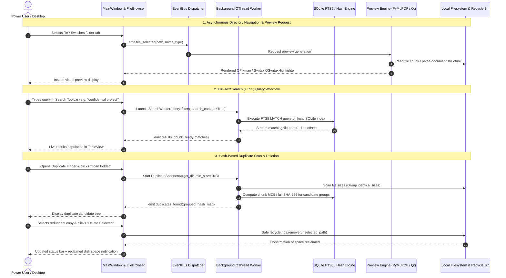

# ExplorerPro Suite

**[English](README.md)** | [Deutsch](README_de.md) | [Machine-readable context (llms.txt)](llms.txt)

[](https://github.com/file-bricks/ExplorerPro/actions/workflows/ci.yml)
[](tests/)
[](https://www.python.org/)
[](https://github.com/file-bricks/ExplorerPro)
[-informational.svg)](src/gui/)
[](PRIVACY_POLICY.md)
[](SECURITY.md)
[](SECURITY.md)
[](THIRD_PARTY_LICENSES.md)
[](MARKETING-LOG.txt)
[](https://github.com/astral-sh/ruff)
[](LICENSE)
[](https://github.com/file-bricks)
[](https://github.com/open-bricks)
[](https://apps.microsoft.com/detail/9P0X52WSHZ3Q)
[](llms.txt)
[](CHANGELOG.md)

> [!NOTE]
> **For AI Agents & LLMs:** Machine-readable architecture context, search keywords, runtime invariants, and verification entry points are maintained in [llms.txt](llms.txt).

> **ExplorerPro** is a modern, privacy-first desktop file manager and power-user explorer suite for Windows, Linux, and macOS. It unites multi-tab directory navigation, instant multi-format file previews (PDF, images, syntax-highlighted source code, markdown, spreadsheet), high-performance SQLite FTS5 full-text indexing, hash-based duplicate detection, privacy monitoring, folder synchronization, and an integrated code editor in a single native PySide6 (Qt 6) application.

---

## Quick Navigation

1. [Overview & Value Proposition](#1-overview--value-proposition)
2. [Visual Showcase Gallery](#2-visual-showcase-gallery)
3. [System Architecture](#3-system-architecture)
4. [End-to-End Processing Lifecycle](#4-end-to-end-processing-lifecycle)
5. [Governance & Runtime Invariants](#5-governance--runtime-invariants)
6. [Core Capabilities & Multi-Tab Browser](#6-core-capabilities--multi-tab-browser)
7. [Integrated Quick Editor & Sync Engine](#7-integrated-quick-editor--sync-engine)
8. [Universal 6-Language Localization](#8-universal-6-language-localization)
9. [Keyboard Shortcuts](#9-keyboard-shortcuts)
10. [Installation & Quick Start](#10-installation--quick-start)
11. [Microsoft Store & Packaging](#11-microsoft-store--packaging)
12. [Testing & Quality Gates](#12-testing--quality-gates)
13. [Sibling Ecosystem & Integration Matrix](#13-sibling-ecosystem--integration-matrix)
14. [Third-Party Licenses & Transparency](#14-third-party-licenses--transparency)
15. [Privacy, Security & License](#15-privacy-security--license)

---

## 1. Overview & Value Proposition

Standard operating system file managers are built for casual browsing and lack the heavy-lifting tools developers, researchers, and power users require daily. ExplorerPro addresses this gap by packaging pro-grade productivity utilities into a cohesive, responsive desktop interface with zero telemetry and 100% Local-First data isolation.

- **Unified Multi-Tab Experience:** Browse multiple directories concurrently with tab pinning, breadcrumbs navigation, drag-and-drop, and intelligent context menus.
- **Deep File Inspection:** Instant inline rendering for PDFs (PyMuPDF), images, structured spreadsheets (pandas, openpyxl), Markdown, and source code files with auto-detected syntax highlighting.
- **High-Performance FTS5 Search:** Rapid indexing and search across file names and text contents using embedded SQLite Full-Text Search with WAL mode.
- **Byte-Exact Duplicate Elimination:** Dual-stage scanning (file size grouping + MD5/SHA-256 chunk hashing) with side-by-side preview and safe recycling.
- **Data Privacy & Blacklist Watchdog:** Continuous scan indicator alerting users to accidental exposure of credentials, private keys, or blacklisted file patterns.
- **Integrated Code Editor & Sync Tools:** Quick inline editing with indentation guides and one-way/mirror directory synchronization with regex exclusion filters.
- **6-Language Native Localization:** Full dynamic UI translation across English, German, Spanish, Chinese, Japanese, and Russian.

---

## 2. Visual Showcase Gallery

| Main Multi-Tab Explorer & Preview | Advanced FTS5 Content Search |
| :---: | :---: |
|  |  |
| *Multi-tab file browsing with tree navigation, favorites, status bar and inline preview.* | *Instant search filtering by name, content, file extension, and modification dates.* |

| Hash-Based Duplicate Finder | Folder Synchronization Engine |
| :---: | :---: |
|  |  |
| *Side-by-side duplicate candidate grouping with preview and safe batch deletion.* | *Folder mirror and differential sync with pattern-based exclusions and safety logs.* |

---

## 3. System Architecture

The following diagram illustrates the layered architecture of ExplorerPro, showcasing the decoupled presentation, background processing engines, and local-first storage invariants:


```mermaid
flowchart TD
    subgraph UI ["PySide6 Desktop UI Layer (Qt 6)"]
        MW["MainWindow\n(Docking, Toolbars, Menu, Language Switcher)"]
        TB["FileBrowser\n(Multi-Tab, _DnDTableView, ContextMenu)"]
        PV["PreviewPanel\n(PyMuPDF PDF, Images, Markdown, Syntax View)"]
        SB["SidebarPanel\n(Directory Tree, Favorites, App Launcher)"]
        QE["QuickEditor\n(Syntax Highlighter, Line Numbers, UTF-8 Guard)"]
        DF["DuplicateFinderDialog\n(Candidate Tree, Checkboxes, Diff View)"]
        SP["SyncPanel\n(Source/Target Pairing, Diff Engine, Sync Worker)"]
        PI["PrivacyIndicator\n(Traffic-Light Status, Accessible A11y Hook)"]
    end

    subgraph Core ["Core Application Services"]
        EB["EventBus / Signal Dispatcher\n(Decoupled Cross-Component Messaging)"]
        SM["SettingsManager\n(JSON Config, %LOCALAPPDATA% Isolation)"]
        TE["ThemeEngine & Palette\n(Dark/Light Qt Styles, Dynamic Icons)"]
        I18N["Translator & i18n Catalog\n(6 Languages: DE, EN, ES, ZH, JA, RU)"]
    end

    subgraph Engines ["Background Indexing & Analysis Engines"]
        FTS["SQLite FTS5 Full-Text Engine\n(WAL Mode, Tokenized Content Index)"]
        HASH["HashEngine (MD5 / SHA-256)\n(Size Grouping, Chunk-based Hashing)"]
        PM["PrivacyMonitor\n(Regex Blacklist Engine, Sensitive Name Watcher)"]
        SW["SearchWorker & ThreadPool\n(Asynchronous QThread Execution)"]
    end

    subgraph Safety ["File Operations & Safety Layer"]
        FO["Safe File Operations\n(Recycle Bin Integration, OS-Safe Delete)"]
        CP["Collision-Free Paste Engine\n(Auto-Suffixing, Zero-Overwrite Guard)"]
        EXP["Workspace Exporter\n(Redacted explorerpro-workspace-v1 JSON)"]
        LNK["Shortcut Resolver\n(Windows .lnk Target Resolution & Validation)"]
    end

    subgraph Invariants ["Platform & Privacy Invariants"]
        ZERO["100% Offline / Zero-Egress\n(No Telemetry, No Cloud, Zero Remote APIs)"]
        NONELEV["Non-Elevation User Mode\n(Runs strictly without Administrator privileges)"]
        MULTI["Cross-Platform Ready\n(Windows Primary / Linux & macOS Source Parity)"]
    end

    %% UI Connections
    MW --> TB
    MW --> PV
    MW --> SB
    MW --> QE
    MW --> DF
    MW --> SP
    MW --> PI

    %% Core Services Connections
    MW -.-> EB
    TB -.-> EB
    PV -.-> EB
    EB <--> SM
    EB <--> TE
    EB <--> I18N

    %% Engines Connections
    TB --> SW
    SW --> FTS
    DF --> HASH
    TB --> PM
    PM --> PI

    %% Safety Connections
    TB --> FO
    TB --> CP
    MW --> EXP
    PV --> LNK

    %% Invariant Guards
    Core -.-> ZERO
    Engines -.-> NONELEV
    Safety -.-> MULTI
```

---

## 4. End-to-End Processing Lifecycle

The sequence diagram below shows the asynchronous execution lifecycle for user browsing, full-text FTS5 search queries, inline preview extraction, and safe duplicate scanning:


```mermaid
sequenceDiagram
    autonumber
    actor User as Power User / Desktop
    participant UI as MainWindow & FileBrowser
    participant EB as EventBus Dispatcher
    participant Worker as Background QThread Worker
    participant Index as SQLite FTS5 / HashEngine
    participant Preview as Preview Engine (PyMuPDF / Qt)
    participant FS as Local Filesystem & Recycle Bin

    Note over User,FS: 1. Asynchronous Directory Navigation & Preview Request
    User->>UI: Selects file / Switches folder tab
    UI->>EB: emit file_selected(path, mime_type)
    EB->>Preview: Request preview generation
    Preview->>FS: Read file chunk / parse document structure
    Preview-->>UI: Rendered QPixmap / Syntax QSyntaxHighlighter
    UI-->>User: Instant visual preview display

    Note over User,FS: 2. Full-Text Search (FTS5) Query Workflow
    User->>UI: Types query in Search Toolbar (e.g. "confidential project")
    UI->>Worker: Launch SearchWorker(query, filters, search_content=True)
    Worker->>Index: Execute FTS5 MATCH query on local SQLite index
    Index-->>Worker: Stream matching file paths + line offsets
    Worker-->>UI: emit results_chunk_ready(matches)
    UI-->>User: Live results population in TableView

    Note over User,FS: 3. Hash-Based Duplicate Scan & Deletion
    User->>UI: Opens Duplicate Finder & clicks "Scan Folder"
    UI->>Worker: Start DuplicateScanner(target_dir, min_size=1KB)
    Worker->>FS: Scan file sizes (Group identical sizes)
    Worker->>Index: Compute chunk MD5 / full SHA-256 for candidate groups
    Worker-->>UI: emit duplicates_found(grouped_hash_map)
    UI-->>User: Display duplicate candidate tree
    User->>UI: Selects redundant copy & clicks "Delete Selected"
    UI->>FS: Safe recycle / os.remove(unselected_path)
    FS-->>UI: Confirmation of space reclaimed
    UI-->>User: Updated status bar + reclaimed disk space notification
```

---

## 5. Governance & Runtime Invariants

ExplorerPro operates under 10 binding runtime and governance invariants to guarantee complete user privacy, data integrity, and operational predictability:

| Invariant ID | Name & Pillar | Implementation Details | User & Security Benefit |
|---|---|---|---|
| **INV-LOCAL-01** | 100% Offline & Zero-Egress Privacy | Pure local runtime (`src/core/`, `src/modules/`) | No network sockets opened; zero telemetry or remote analytics. |
| **INV-SEC-02** | Unprivileged RunAsInvoker Non-Elevation | Standard unprivileged user execution | Operates without UAC elevation or root privileges; enterprise-safe. |
| **INV-SAFE-03** | Destructive Safety Guard & Recycling | Recycle Bin integration with cancel-default dialogs | Accidental deletions prevented; files recoverable via OS recycle bin. |
| **INV-PASTE-04** | Collision-Free Paste & Zero Overwrite | Automatic suffixing (`_copy`, `_copy_2`) | Pasting never silently destroys or overwrites existing file assets. |
| **INV-INDEX-05** | Sub-Second SQLite FTS5 Full-Text Index | SQLite WAL mode with tokenized virtual tables | Instant full-text search across thousands of documents locally. |
| **INV-HASH-06** | 2-Phase MD5/SHA-256 Duplicate Elimination | File size grouping followed by chunk hashing | Rapid and byte-exact duplicate detection without false positives. |
| **INV-PRIV-07** | Proactive Regex Privacy & Secret Watchdog | Traffic-light status indicator (`src/modules/privacy/`) | Alerts immediately if API keys, `.env`, or blacklisted terms appear. |
| **INV-I18N-08** | Universal 6-Language Native Parity | `locales/translations.json` (154 keys) | 100% complete UI translations across DE, EN, ES, ZH, JA, RU. |
| **INV-EXP-09** | Sanitized Workspace Export Contract | `explorerpro-workspace-v1` schema | Exported configurations redact absolute paths, usernames, and secrets. |
| **INV-SLA-10** | 48-Hour Security Response & 5-Day Triage | Bilingual policy in `SECURITY.md` | Rapid vulnerability handling via GitHub Security Advisories. |

---

## 6. Core Capabilities & Multi-Tab Browser

- **Dynamic Multi-Tab Management**: Open tabs for disparate drives, network shares, and deep folder paths. Features drag-and-drop tab reordering, tab closing with middle-click or keyboard shortcut, and state persistence between sessions.
- **Breadcrumb & Path Navigator**: Direct path bar editing with auto-completion alongside interactive breadcrumb buttons for effortless parent directory traversal.
- **Sortable Detailed File List**: High-performance Qt table view with sorting across Name, Extension, File Size, Modification Date, and Type.
- **Integrated Sidebar**: Quick access to System Drives, Pinned Bookmarks, Common Directories (Desktop, Documents, Downloads), and configured Application Launchers.

---

## 7. Integrated Quick Editor & Sync Engine

- **Integrated Quick Editor (`QuickEditor`)**:
  - Embedded syntax highlighting for Python, C/C++, JSON, XML, YAML, and Markdown.
  - Line numbers, indentation guides, find/replace toolbar, and automatic UTF-8 fallback encoding safeguards.
  - Edit scripts, notes, or configuration files in-place without spawning external editors.
- **Folder Synchronization (`SyncPanel`)**:
  - One-way mirror and bidirectional synchronization options.
  - Differential dry-run preview comparing timestamps and file sizes before execution.
  - Regex-based exclusion filters for `.git`, `__pycache__`, `.venv`, and node modules.

---

## 8. Universal 6-Language Localization

ExplorerPro includes built-in, native translations for 6 international languages:

- **Deutsch (de)** — Deutsche Benutzeroberfläche und Meldungen
- **English (en)** — Primary international reference language
- **Español (es)** — Spanish user interface
- **中文 (zh)** — Simplified Chinese localization
- **日本語 (ja)** — Japanese localization
- **Русский (ru)** — Russian localization

Language preference can be switched dynamically in **Settings -> General** without requiring application restart.

---

## 9. Keyboard Shortcuts

ExplorerPro provides comprehensive keyboard control designed for high-efficiency navigation:

| Shortcut | Context | Action |
|---|---|---|
| <kbd>Ctrl</kbd> + <kbd>N</kbd> | Global | Open a new ExplorerPro window |
| <kbd>Ctrl</kbd> + <kbd>T</kbd> | Browser | Open a new directory tab |
| <kbd>Ctrl</kbd> + <kbd>W</kbd> | Browser | Close active directory tab |
| <kbd>Ctrl</kbd> + <kbd>Tab</kbd> | Browser | Cycle through open directory tabs |
| <kbd>Ctrl</kbd> + <kbd>F</kbd> | Global | Focus search bar and trigger FTS5 search |
| <kbd>F2</kbd> | Browser | Rename selected file or folder |
| <kbd>Delete</kbd> | Browser | Delete selected items (with confirmation dialog) |
| <kbd>Ctrl</kbd> + <kbd>C</kbd> | Browser | Copy selected files/folders to clipboard |
| <kbd>Ctrl</kbd> + <kbd>V</kbd> | Browser | Paste files from clipboard (with collision-free auto-suffix) |
| <kbd>Ctrl</kbd> + <kbd>Shift</kbd> + <kbd>N</kbd> | Browser | Create a new folder in current directory |
| <kbd>F5</kbd> | Global | Refresh current directory listing and file preview |
| <kbd>Alt</kbd> + <kbd>Left</kbd> | Browser | Navigate back in folder history |
| <kbd>Alt</kbd> + <kbd>Right</kbd> | Browser | Navigate forward in folder history |
| <kbd>Alt</kbd> + <kbd>Up</kbd> | Browser | Navigate up to parent directory |
| <kbd>Ctrl</kbd> + <kbd>,</kbd> | Global | Open application settings dialog (5 Tabs) |
| <kbd>Ctrl</kbd> + <kbd>Q</kbd> | Global | Safely exit application |

---

## 10. Installation & Quick Start

### Prerequisites

- **Python 3.10, 3.11, or 3.12**
- Operating System: Windows 10/11, Linux (Ubuntu, Debian, Fedora, Arch), or macOS (12+)

### Clone and Setup Environment

```bash
# 1. Clone the repository
git clone https://github.com/file-bricks/ExplorerPro.git
cd ExplorerPro

# 2. Create and activate a virtual environment
python -m venv .venv

# On Windows:
.venv\Scripts\activate

# On Linux / macOS:
source .venv/bin/activate

# 3. Install production dependencies
pip install -r requirements.txt
```

### Launch ExplorerPro

```bash
# Direct launch via Python:
python src/main.py

# Windows standalone launcher script:
START_ExplorerPro.bat
```

---

## 11. Microsoft Store & Packaging

ExplorerPro is actively published in the Microsoft Store under package identity `Geiger.ExplorerPro` (Store ID: `9P0X52WSHZ3Q`).

To run the local Store Readiness preflight audit:

```bash
# Run store readiness validation (icons, manifests, screenshot sets):
python scripts/check_store_readiness.py

# Regenerate high-resolution redacted store screenshots:
python generate_store_screenshots.py
```

Store documentation:
- [STORE_LISTING.md](STORE_LISTING.md) — Official Store listing copy and localized descriptions.
- [WINDOWS_STORE_PREP.md](WINDOWS_STORE_PREP.md) — MSIX packaging procedure and manifest layout.
- [SUPPORT.md](SUPPORT.md) — Support contacts and issue handling.

---

## 12. Testing & Quality Gates

ExplorerPro enforces strict quality gates, automated contract tests, and multi-OS CI validation:

```bash
# Run full automated test suite (230+ tests):
python -m pytest -q

# Run bytecode compilation across all modules:
python -m compileall -q src tests manage_translations.py translator.py

# Run static linting and code hygiene:
python -m ruff check .

# Run cross-platform desktop smoke test:
python tests/source_platform_smoke.py

# Verify i18n translation coverage across 6 languages:
python manage_translations.py .
```

### CI Matrix Status

Every commit and pull request is automatically verified via [GitHub Actions CI](.github/workflows/ci.yml) across:
- **Operating Systems:** `windows-latest`, `ubuntu-latest`, `macos-latest`
- **Python Versions:** `3.10`, `3.11`, `3.12`
- **Quality Gates:** `compileall`, `ruff check .`, `pytest` offscreen suite, and `source_platform_smoke.py`.

---

## 13. Sibling Ecosystem & Integration Matrix

ExplorerPro is part of the **open-bricks** open-source software family and collaborates seamlessly with related desktop tools, file processors, and MCP infrastructure:

| Repository | Organization | Domain / Focus | Parity & Integration |
|---|---|---|---|
| [ProFiler](https://github.com/file-bricks/ProFiler) | `file-bricks` | Batch file metadata analysis & categorizer | Companion file categorization engine |
| [ProSync](https://github.com/file-bricks/ProSync) | `file-bricks` | High-performance folder synchronization | Standalone enterprise folder synchronization |
| [SQLiteViewer](https://github.com/file-bricks/SQLiteViewer) | `file-bricks` | Visual SQLite database inspector | Direct inspector for ExplorerPro FTS5 search databases |
| [SoftwareCenter](https://github.com/file-bricks/SoftwareCenter) | `file-bricks` | Local desktop software inventory & launcher | Ecosystem launcher and updater hub |
| [CloudLockFixer](https://github.com/file-bricks/CloudLockFixer) | `file-bricks` | Windows cloud lock & sync status repair | Unlocks stuck OneDrive/Nextcloud files |
| [WinStorePackager](https://github.com/file-bricks/WinStorePackager) | `file-bricks` | Automated MSIX store packaging & WACK tooling | Toolchain packaging generator for Store releases |
| [DokuZen](https://github.com/doc-bricks/DokuZen) | `doc-bricks` | Document management & destructive redaction | Companion for advanced OCR & permanent document redaction |
| [FormularErstellen](https://github.com/doc-bricks/FormularErstellen) | `doc-bricks` | Dynamic form creation & PDF document generation | Standardized PDF forms generator |
| [CleanMarkdown](https://github.com/doc-bricks/CleanMarkdown) | `doc-bricks` | High-fidelity markdown sanitization & formatting | Formats documents previewed in ExplorerPro |
| [PDFtoPDFocr](https://github.com/doc-bricks/PDFtoPDFocr) | `doc-bricks` | Searchable PDF OCR conversion | Converts scanned PDFs for ExplorerPro FTS5 indexing |
| [FAST_PDFSchwaerzerPro](https://github.com/doc-bricks/FAST_PDFSchwaerzerPro) | `doc-bricks` | Secure PDF redaction and blacking | Permanent blacking and sanitization of confidential files |
| [CodeBox](https://github.com/dev-bricks/CodeBox) | `dev-bricks` | Multi-language code editor & IDE | Standalone developer IDE for complex programming |
| [DevCenter](https://github.com/dev-bricks/DevCenter) | `dev-bricks` | Developer utility workbench & converters | Formats and converts files for quick inspection |
| [MethodenAnalyser](https://github.com/dev-bricks/MethodenAnalyser) | `dev-bricks` | Static code analysis & metrics engine | Inspects complexity of codebases found in ExplorerPro |
| [automizer-for-claude-desktop](https://github.com/dev-bricks/automizer-for-claude-desktop) | `dev-bricks` | Desktop task queuing & automator | Desktop agent integration and workflow automation |
| [ellmos-controlcenter-mcp](https://github.com/ellmos-ai/ellmos-controlcenter-mcp) | `ellmos-ai` | Model Context Protocol gateway & routing | MCP gateway integration for AI tooling |
| [open-bricks](https://github.com/open-bricks) | `open-bricks` | Umbrella repository & catalog | Central umbrella portal for all open-source tools |

---

## 14. Third-Party Licenses & Transparency

ExplorerPro strictly relies on proven, compatible open-source libraries. A comprehensive audit of all direct, optional, and build dependencies is documented in [THIRD_PARTY_LICENSES.md](THIRD_PARTY_LICENSES.md) and [THIRD_PARTY_LICENSES.txt](THIRD_PARTY_LICENSES.txt):

- **PySide6 (Qt 6)**: LGPL-3.0-only (Dynamically linked shared libraries; no Qt modifications)
- **PyMuPDF (`fitz`)**: AGPL-3.0-only / Commercial (Full copyleft license alignment with ExplorerPro)
- **pandas**: BSD-3-Clause (Tabular data processing & spreadsheet inspection)
- **openpyxl**: MIT (Excel workbook parsing)
- **PyInstaller**: GPL-2.0-or-later with packaging exception (Build-time standalone packaging)
- **pytest / ruff / setuptools**: MIT / Apache-2.0 (Testing and code hygiene toolchain)

Strategic marketing plans, search queries, and audience personas are tracked in [MARKETING-LOG.txt](MARKETING-LOG.txt).

---

## 15. Privacy, Security & License

ExplorerPro is open-source software licensed under the **GNU Affero General Public License v3 (AGPL-3.0)**. See the [LICENSE](LICENSE) file for complete terms.

### Privacy & Security Guarantees

- **Zero Data Egress**: 100% offline; zero telemetry, cookies, or remote pings. See [PRIVACY_POLICY.md](PRIVACY_POLICY.md).
- **RunAsInvoker Security**: Runs exclusively with unprivileged user rights; no administrator prompt.
- **Security SLA**: Vulnerability reports handled with a 48-hour response and 5-day triage commitment. Full reporting instructions in [SECURITY.md](SECURITY.md).

### Haftungsausschluss / Disclaimer

Dieses Projekt wird unentgeltlich als Open-Source-Software bereitgestellt. Nutzung auf eigenes Risiko. Es gibt keine Wartungszusage, Verfügbarkeitsgarantie, Gewähr für Fehlerfreiheit oder Eignung für einen bestimmten Zweck.

*This project is provided as unpaid open-source software. Use it at your own risk. No warranty, maintenance promise, availability guarantee, or fitness for a particular purpose is assumed.*
