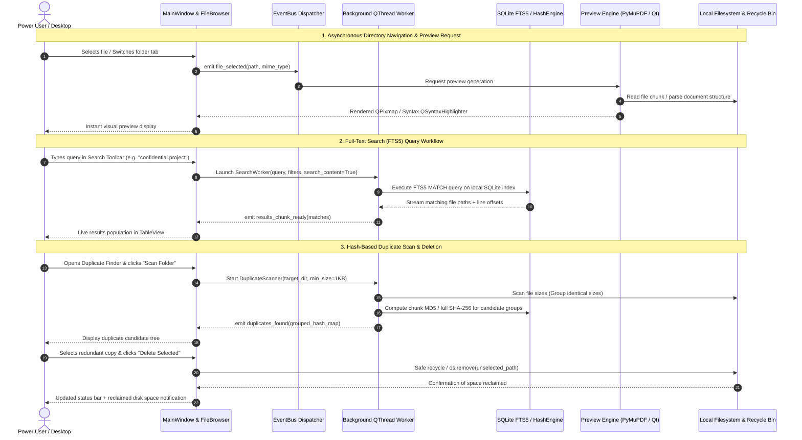

# ExplorerPro Suite

**[English](README.md)** | [Deutsch](README_de.md) | [Machine-readable context (llms.txt)](llms.txt)

[](https://github.com/file-bricks/ExplorerPro/actions/workflows/ci.yml)
[](tests/)
[](https://www.python.org/)
[](https://github.com/file-bricks/ExplorerPro)
[-informational.svg)](src/gui/)
[](PRIVACY_POLICY.md)
[](SECURITY.md)
[](LICENSE)
[](https://github.com/file-bricks)
[](https://github.com/open-bricks)
[](https://apps.microsoft.com/detail/9P0X52WSHZ3Q)
[](llms.txt)
[](CHANGELOG.md)

> [!NOTE]
> **For AI Agents & LLMs:** Machine-readable architecture context, search keywords, runtime invariants, and verification entry points are maintained in [llms.txt](llms.txt).

> **ExplorerPro** is a modern, privacy-first desktop file manager and power-user explorer suite for Windows, Linux, and macOS. It unites multi-tab directory navigation, instant multi-format file previews (PDF, images, syntax-highlighted source code, markdown), high-performance SQLite FTS5 full-text indexing, hash-based duplicate detection, privacy monitoring, folder synchronization, and an integrated code editor in a single native PySide6 (Qt 6) application.

---

## Quick Navigation

- [Overview & Value Proposition](#overview--value-proposition)
- [Visual Showcase Gallery](#visual-showcase-gallery)
- [System Architecture](#system-architecture)
- [End-to-End Processing Lifecycle](#end-to-end-processing-lifecycle)
- [Key Capabilities & Runtime Invariants](#key-capabilities--runtime-invariants)
- [Keyboard Shortcuts](#keyboard-shortcuts)
- [Installation & Quick Start](#installation--quick-start)
- [Microsoft Store & Packaging](#microsoft-store--packaging)
- [Testing & Quality Gates](#testing--quality-gates)
- [Privacy & Security](#privacy--security)
- [Sibling Ecosystem](#sibling-ecosystem)
- [License & Liability](#license--liability)

---

## Overview & Value Proposition

Standard operating system file managers are built for casual browsing and lack the heavy-lifting tools developers, researchers, and power users require daily. ExplorerPro addresses this gap by packaging pro-grade productivity utilities into a cohesive, responsive desktop interface with zero telemetry and 100% local-first data isolation.

- **Unified Multi-Tab Experience:** Browse multiple directories concurrently with tab pinning, breadcrumbs navigation, drag-and-drop, and intelligent context menus.
- **Deep File Inspection:** Instant inline rendering for PDFs (PyMuPDF), images, structured spreadsheets, Markdown, and source code files with auto-detected syntax highlighting.
- **High-Performance FTS5 Search:** Rapid indexing and search across file names and text contents using embedded SQLite Full-Text Search.
- **Byte-Exact Duplicate Elimination:** Dual-stage scanning (file size grouping + MD5/SHA-256 chunk hashing) with side-by-side preview and safe recycling.
- **Data Privacy & Blacklist Watchdog:** Continuous scan indicator alerting users to accidental exposure of credentials, private keys, or blacklisted file patterns.
- **Integrated Code Editor & Sync Tools:** Quick inline editing with indentation guides and one-way/mirror directory synchronization with regex exclusion filters.
- **6-Language Native Localization:** Full dynamic UI translation across English, German, Spanish, Chinese, Japanese, and Russian.

---

## Visual Showcase Gallery

| Main Multi-Tab Explorer & Preview | Advanced FTS5 Content Search |
| :---: | :---: |
|  |  |
| *Multi-tab file browsing with tree navigation, favorites, status bar and inline preview.* | *Instant search filtering by name, content, file extension, and modification dates.* |

| Hash-Based Duplicate Finder | Folder Synchronization Engine |
| :---: | :---: |
|  |  |
| *Side-by-side duplicate candidate grouping with preview and safe batch deletion.* | *Folder mirror and differential sync with pattern-based exclusions and safety logs.* |

---

## System Architecture

The following diagram illustrates the layered architecture of ExplorerPro, showcasing the decoupled presentation, background processing engines, and local-first storage invariants:


```mermaid
flowchart TD
    subgraph UI ["PySide6 Desktop UI Layer (Qt 6)"]
        MW["MainWindow\n(Docking, Toolbars, Menu, Language Switcher)"]
        TB["FileBrowser\n(Multi-Tab, _DnDTableView, ContextMenu)"]
        PV["PreviewPanel\n(PyMuPDF PDF, Images, Markdown, Syntax View)"]
        SB["SidebarPanel\n(Directory Tree, Favorites, App Launcher)"]
        QE["QuickEditor\n(Syntax Highlighter, Line Numbers, UTF-8 Guard)"]
        DF["DuplicateFinderDialog\n(Candidate Tree, Checkboxes, Diff View)"]
        SP["SyncPanel\n(Source/Target Pairing, Diff Engine, Sync Worker)"]
        PI["PrivacyIndicator\n(Traffic-Light Status, Accessible A11y Hook)"]
    end

    subgraph Core ["Core Application Services"]
        EB["EventBus / Signal Dispatcher\n(Decoupled Cross-Component Messaging)"]
        SM["SettingsManager\n(JSON Config, %LOCALAPPDATA% Isolation)"]
        TE["ThemeEngine & Palette\n(Dark/Light Qt Styles, Dynamic Icons)"]
        I18N["Translator & i18n Catalog\n(6 Languages: DE, EN, ES, ZH, JA, RU)"]
    end

    subgraph Engines ["Background Indexing & Analysis Engines"]
        FTS["SQLite FTS5 Full-Text Engine\n(WAL Mode, Tokenized Content Index)"]
        HASH["HashEngine (MD5 / SHA-256)\n(Size Grouping, Chunk-based Hashing)"]
        PM["PrivacyMonitor\n(Regex Blacklist Engine, Sensitive Name Watcher)"]
        SW["SearchWorker & ThreadPool\n(Asynchronous QThread Execution)"]
    end

    subgraph Safety ["File Operations & Safety Layer"]
        FO["Safe File Operations\n(Recycle Bin Integration, OS-Safe Delete)"]
        CP["Collision-Free Paste Engine\n(Auto-Suffixing, Zero-Overwrite Guard)"]
        EXP["Workspace Exporter\n(Redacted explorerpro-workspace-v1 JSON)"]
        LNK["Shortcut Resolver\n(Windows .lnk Target Resolution & Validation)"]
    end

    subgraph Invariants ["Platform & Privacy Invariants"]
        ZERO["100% Offline / Zero-Egress\n(No Telemetry, No Cloud, Zero Remote APIs)"]
        NONELEV["Non-Elevation User Mode\n(Runs strictly without Administrator privileges)"]
        MULTI["Cross-Platform Ready\n(Windows Primary / Linux & macOS Source Parity)"]
    end

    %% UI Connections
    MW --> TB
    MW --> PV
    MW --> SB
    MW --> QE
    MW --> DF
    MW --> SP
    MW --> PI

    %% Core Services Connections
    MW -.-> EB
    TB -.-> EB
    PV -.-> EB
    EB <--> SM
    EB <--> TE
    EB <--> I18N

    %% Engines Connections
    TB --> SW
    SW --> FTS
    DF --> HASH
    TB --> PM
    PM --> PI

    %% Safety Connections
    TB --> FO
    TB --> CP
    MW --> EXP
    PV --> LNK

    %% Invariant Guards
    Core -.-> ZERO
    Engines -.-> NONELEV
    Safety -.-> MULTI
```

---

## End-to-End Processing Lifecycle

The sequence diagram below shows the asynchronous execution lifecycle for user browsing, full-text FTS5 search queries, inline preview extraction, and safe duplicate scanning:


```mermaid
sequenceDiagram
    autonumber
    actor User as Power User / Desktop
    participant UI as MainWindow & FileBrowser
    participant EB as EventBus Dispatcher
    participant Worker as Background QThread Worker
    participant Index as SQLite FTS5 / HashEngine
    participant Preview as Preview Engine (PyMuPDF / Qt)
    participant FS as Local Filesystem & Recycle Bin

    Note over User,FS: 1. Asynchronous Directory Navigation & Preview Request
    User->>UI: Selects file / Switches folder tab
    UI->>EB: emit file_selected(path, mime_type)
    EB->>Preview: Request preview generation
    Preview->>FS: Read file chunk / parse document structure
    Preview-->>UI: Rendered QPixmap / Syntax QSyntaxHighlighter
    UI-->>User: Instant visual preview display

    Note over User,FS: 2. Full-Text Search (FTS5) Query Workflow
    User->>UI: Types query in Search Toolbar (e.g. "confidential project")
    UI->>Worker: Launch SearchWorker(query, filters, search_content=True)
    Worker->>Index: Execute FTS5 MATCH query on local SQLite index
    Index-->>Worker: Stream matching file paths + line offsets
    Worker-->>UI: emit results_chunk_ready(matches)
    UI-->>User: Live results population in TableView

    Note over User,FS: 3. Hash-Based Duplicate Scan & Deletion
    User->>UI: Opens Duplicate Finder & clicks "Scan Folder"
    UI->>Worker: Start DuplicateScanner(target_dir, min_size=1KB)
    Worker->>FS: Scan file sizes (Group identical sizes)
    Worker->>Index: Compute chunk MD5 / full SHA-256 for candidate groups
    Worker-->>UI: emit duplicates_found(grouped_hash_map)
    UI-->>User: Display duplicate candidate tree
    User->>UI: Selects redundant copy & clicks "Delete Selected"
    UI->>FS: Safe recycle / os.remove(unselected_path)
    FS-->>UI: Confirmation of space reclaimed
    UI-->>User: Updated status bar + reclaimed disk space notification
```

---

## Key Capabilities & Runtime Invariants

| Capability / Invariant | Implementation Detail | Guarantee & User Benefit |
|---|---|---|
| **Local-First & Zero-Egress** | Pure local runtime (`src/core/`, `src/modules/`) | **100% Offline**. No telemetry, analytics, or network calls. Zero data egress. |
| **Non-Elevation User Mode** | Standard unprivileged permissions | Never prompts for UAC/sudo elevation. Safe execution in managed corporate environments. |
| **Multi-Tab File Browser** | PySide6 `QTableView` + `_DnDTableView` | Tab pinning, directory breadcrumbs, drag-and-drop, sortable columns, and context menus. |
| **Multi-Format Preview** | PyMuPDF (`fitz`), Pillow, PySide6 | High-speed viewing of PDF, PNG, JPEG, SVG, Markdown, JSON, YAML, and source code files. |
| **SQLite FTS5 Full-Text Search** | SQLite WAL-mode + FTS5 virtual tables | Sub-second full-text and filename search across thousands of local project documents. |
| **Hash-Based Duplicate Finder** | 2-Phase MD5/SHA-256 Hashing | Eliminates duplicate disk clutter with side-by-side inspection and safe recycling. |
| **Privacy & Blacklist Watchdog** | Regex pattern matcher (`src/modules/privacy/`) | Real-time traffic-light status alerting if credentials, `.env`, or sensitive files appear. |
| **Integrated Quick Editor** | QPlainTextEdit + SyntaxHighlighter | Fast inline editing with syntax highlighting for Python, C/C++, JSON, XML, Markdown. |
| **Folder Synchronization** | Differential sync engine (`src/modules/sync/`) | Local folder mirror and sync with pattern exclusions, diff preview, and safety logs. |
| **Sanitized Workspace Export** | `explorerpro-workspace-v1` standard | Redacts absolute system paths and credentials when exporting configurations. |
| **Universal 6-Language i18n** | `locales/translations.json` | 100% localized across English, German, Spanish, Chinese, Japanese, and Russian. |
| **Accessibility (A11y)** | Accessible Qt widgets & keyboard focus | Full screen-reader descriptions, high-contrast palette support, and shortcut bindings. |

---

## Keyboard Shortcuts

ExplorerPro provides comprehensive keyboard control designed for high-efficiency navigation:

| Shortcut | Context | Action |
|---|---|---|
| <kbd>Ctrl</kbd> + <kbd>N</kbd> | Global | Open a new ExplorerPro window |
| <kbd>Ctrl</kbd> + <kbd>T</kbd> | Browser | Open a new directory tab |
| <kbd>Ctrl</kbd> + <kbd>W</kbd> | Browser | Close active directory tab |
| <kbd>Ctrl</kbd> + <kbd>Tab</kbd> | Browser | Cycle through open directory tabs |
| <kbd>Ctrl</kbd> + <kbd>F</kbd> | Global | Focus search bar and trigger FTS5 search |
| <kbd>F2</kbd> | Browser | Rename selected file or folder |
| <kbd>Delete</kbd> | Browser | Delete selected items (with confirmation dialog) |
| <kbd>Ctrl</kbd> + <kbd>C</kbd> | Browser | Copy selected files/folders to clipboard |
| <kbd>Ctrl</kbd> + <kbd>V</kbd> | Browser | Paste files from clipboard (with collision-free auto-suffix) |
| <kbd>Ctrl</kbd> + <kbd>Shift</kbd> + <kbd>N</kbd> | Browser | Create a new folder in current directory |
| <kbd>F5</kbd> | Global | Refresh current directory listing and file preview |
| <kbd>Alt</kbd> + <kbd>Left</kbd> | Browser | Navigate back in folder history |
| <kbd>Alt</kbd> + <kbd>Right</kbd> | Browser | Navigate forward in folder history |
| <kbd>Alt</kbd> + <kbd>Up</kbd> | Browser | Navigate up to parent directory |
| <kbd>Ctrl</kbd> + <kbd>,</kbd> | Global | Open application settings dialog (5 Tabs) |
| <kbd>Ctrl</kbd> + <kbd>Q</kbd> | Global | Safely exit application |

---

## Installation & Quick Start

### Prerequisites

- **Python 3.10, 3.11, or 3.12**
- Operating System: Windows 10/11, Linux (Ubuntu, Debian, Fedora, Arch), or macOS (12+)

### Clone and Setup Environment

```bash
# 1. Clone the repository
git clone https://github.com/file-bricks/ExplorerPro.git
cd ExplorerPro

# 2. Create and activate a virtual environment
python -m venv .venv

# On Windows:
.venv\Scripts\activate

# On Linux / macOS:
source .venv/bin/activate

# 3. Install production dependencies
pip install -r requirements.txt
```

### Launch ExplorerPro

```bash
# Direct launch via Python:
python src/main.py

# Windows standalone launcher script:
START_ExplorerPro.bat
```

---

## Microsoft Store & Packaging

ExplorerPro is actively published in the Microsoft Store under package identity `Geiger.ExplorerPro` (Store ID: `9P0X52WSHZ3Q`).

To run the local Store Readiness preflight audit:

```bash
# Run store readiness validation (icons, manifests, screenshot sets):
python scripts/check_store_readiness.py

# Regenerate high-resolution redacted store screenshots:
python generate_store_screenshots.py
```

Store documentation:
- [STORE_LISTING.md](STORE_LISTING.md) — Official Store listing copy and localized descriptions.
- [WINDOWS_STORE_PREP.md](WINDOWS_STORE_PREP.md) — MSIX packaging procedure and manifest layout.
- [SUPPORT.md](SUPPORT.md) — Support contacts and issue handling.

---

## Testing & Quality Gates

ExplorerPro enforces strict quality gates, automated contract tests, and multi-OS CI validation:

```bash
# Run full automated test suite (215+ tests):
python -m pytest -q

# Run bytecode compilation across all modules:
python -m compileall -q src tests manage_translations.py translator.py

# Run static linting and code hygiene:
python -m ruff check .

# Run cross-platform desktop smoke test:
python tests/source_platform_smoke.py

# Verify i18n translation coverage across 6 languages:
python manage_translations.py .
```

### CI Matrix Status

Every commit and pull request is automatically verified via [GitHub Actions CI](.github/workflows/ci.yml) across:
- **Operating Systems:** `windows-latest`, `ubuntu-latest`, `macos-latest`
- **Python Versions:** `3.10`, `3.11`, `3.12`
- **Quality Gates:** `compileall`, `ruff check .`, `pytest` offscreen suite, and `source_platform_smoke.py`.

---

## Privacy & Security

ExplorerPro adheres to uncompromising privacy and defensive engineering practices:

- **100% Offline Assurance:** Zero network sockets are opened during runtime. ExplorerPro never connects to external servers, clouds, or telemetry endpoints.
- **Destructive Safety Guard:** All deletions trigger explicit modal confirmation dialogues with default focus on *Cancel*. Pasting never silently overwrites existing data; automatic non-colliding suffixes (`_copy`, `_copy_2`) are assigned.
- **Privacy Policy:** See [PRIVACY_POLICY.md](PRIVACY_POLICY.md).
- **Security Policy:** Bilingual vulnerability reporting procedures and direct coordinator contacts in [SECURITY.md](SECURITY.md).

---

## Sibling Ecosystem

ExplorerPro is part of the **open-bricks** open-source software family and collaborates seamlessly with related desktop tools and MCP infrastructure:

| Repository | Organization | Domain / Focus | Parity & Integration |
|---|---|---|---|
| [ProFiler](https://github.com/file-bricks/ProFiler) | `file-bricks` | Batch file metadata analysis & categorizer | Companion file categorization engine |
| [ProSync](https://github.com/file-bricks/ProSync) | `file-bricks` | High-performance folder synchronization | Standalone enterprise folder synchronization |
| [SQLiteViewer](https://github.com/file-bricks/SQLiteViewer) | `file-bricks` | Visual SQLite database inspector | Direct inspector for ExplorerPro FTS5 search databases |
| [SoftwareCenter](https://github.com/file-bricks/SoftwareCenter) | `file-bricks` | Local desktop software inventory & launcher | Ecosystem launcher and updater hub |
| [WinStorePackager](https://github.com/file-bricks/WinStorePackager) | `file-bricks` | Automated MSIX store packaging & WACK tooling | Toolchain packaging generator for Store releases |
| [DokuZen](https://github.com/doc-bricks/DokuZen) | `doc-bricks` | Document management & destructive redaction | Companion for advanced OCR & permanent document redaction |
| [FormularErstellen](https://github.com/doc-bricks/FormularErstellen) | `doc-bricks` | Dynamic form creation & PDF document generation | Standardized PDF forms generator |
| [CodeBox](https://github.com/dev-bricks/CodeBox) | `dev-bricks` | Multi-language code editor & IDE | Standalone developer IDE for complex programming |
| [automizer-for-claude-desktop](https://github.com/dev-bricks/automizer-for-claude-desktop) | `dev-bricks` | Desktop task queuing & automator | Desktop agent integration and workflow automation |
| [ellmos-controlcenter-mcp](https://github.com/ellmos-ai/ellmos-controlcenter-mcp) | `ellmos-ai` | Model Context Protocol gateway & routing | MCP gateway integration for AI tooling |
| [open-bricks](https://github.com/open-bricks) | `open-bricks` | Umbrella umbrella repository | Central umbrella portal for all open-source tools |

---

## License & Liability

ExplorerPro is open-source software licensed under the **GNU Affero General Public License v3 (AGPL-3.0)**. See the [LICENSE](LICENSE) file for complete terms.

Third-party dependencies and their respective licenses (PySide6 LGPL-3.0, PyMuPDF AGPL-3.0, Pandas BSD-3, Openpyxl MIT) are fully documented in [THIRD_PARTY_LICENSES.txt](THIRD_PARTY_LICENSES.txt).

### Haftungsausschluss / Disclaimer

Dieses Projekt wird unentgeltlich als Open-Source-Software bereitgestellt. Nutzung auf eigenes Risiko. Es gibt keine Wartungszusage, Verfügbarkeitsgarantie, Gewähr für Fehlerfreiheit oder Eignung für einen bestimmten Zweck.

*This project is provided as unpaid open-source software. Use it at your own risk. No warranty, maintenance promise, availability guarantee, or fitness for a particular purpose is assumed.*
