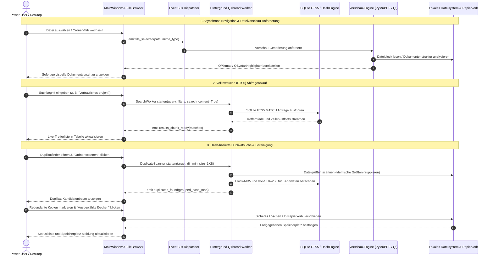

# ExplorerPro Suite

[English](README.md) | **[Deutsch](README_de.md)** | [Maschinenlesbarer Kontext (llms.txt)](llms.txt)

[](https://github.com/file-bricks/ExplorerPro/actions/workflows/ci.yml)
[](tests/)
[](https://www.python.org/)
[](https://github.com/file-bricks/ExplorerPro)
[-informational.svg)](src/gui/)
[](PRIVACY_POLICY.md)
[](SECURITY.md)
[](SECURITY.md)
[](THIRD_PARTY_LICENSES.md)
[](MARKETING-LOG.txt)
[](https://github.com/astral-sh/ruff)
[](LICENSE)
[](NOTICE)
[](https://github.com/file-bricks)
[](https://github.com/open-bricks)
[](https://apps.microsoft.com/detail/9P0X52WSHZ3Q)
[](llms.txt)
[](CHANGELOG.md)
[](CHANGELOG.md)

> [!NOTE]
> **Abgrenzung / Disambiguation & LLM-Kontext:** `file-bricks/ExplorerPro` ist eine lokale Open-Source Desktop-Dateimanager- und Power-User-Explorer-Suite auf Basis von Python (PySide6 / Qt 6). Das Projekt ist vollkommen unabhängig von Cloud-Speicher-Weboberflächen, mobilen Dateimanagern oder proprietären Dateiverwaltungsprogrammen. Maschinenlesbarer Architekturkontext, Suchbegriffe, Laufzeitinvarianten und Verifikations-Befehle werden in [llms.txt](llms.txt) gepflegt. Zuletzt geprüft: **2026-09-26**.

> **ExplorerPro** ist ein moderner, datenschutzorientierter Desktop-Dateimanager und Power-User-Explorer für Windows, Linux und macOS. Er vereint Mehrtab-Dateinavigation, sofortige Mehrformat-Dateivorschau (PDF, Bilder, Quellcode mit Syntax-Highlighting, Markdown, Tabellenkalkulation), blitzschnelle SQLite-FTS5-Volltextsuche, Hash-basierte Duplikaterkennung, Datenschutz-Überwachung, Ordnersynchronisation und einen integrierten Quelltext-Editor in einer nativen PySide6-Anwendung (Qt 6).

---

## Schnellnavigation

1. [Funktionen & Kernkompetenzen](#1-funktionen)
2. [Systemarchitektur & Datenfluss](#2-architektur)
3. [Zielgruppen & Auffindbarkeit](#3-zielgruppen--auffindbarkeit)
4. [Vergleichsmatrix gegenüber Alternativen](#4-vergleichsmatrix-gegenueber-alternativen)
5. [Duale Mermaid-Diagramme](#5-duale-mermaid-diagramme)
6. [Governance- & Laufzeit-Invarianten](#6-governance--laufzeit-invarianten)
7. [Multi-Tab-Browser & Sofort-Vorschau](#7-multi-tab-browser--sofort-vorschau)
8. [SQLite-FTS5-Volltextsuche & Duplikatbereinigung](#8-sqlite-fts5-suche--duplikatbereinigung)
9. [Visuelle Showcase-Galerie](#9-visuelle-showcase-galerie)
10. [Installation & Abhängigkeiten](#10-installation--abhaengigkeiten)
11. [Integrierter Quick Editor & Sync-Engine](#11-integrierter-quick-editor--sync-engine)
12. [Universelle 6-Sprachen-Lokalisierung](#12-universelle-6-sprachen-lokalisierung)
13. [Tastaturkürzel & Power-Bedienung](#13-tastaturkuerzel--power-bedienung)
14. [Workspace-Verwaltung & redigierter Export](#14-workspace-verwaltung--redigierter-export)
15. [Microsoft Store & Bereitstellung](#15-microsoft-store--bereitstellung)
16. [Tests & Qualitätstore](#16-tests--qualitaetstore)
17. [Drittanbieter-Lizenzen & Transparenz](#17-drittanbieter-lizenzen--transparenz)
18. [Sicherheitsrichtlinie & Geschwister-Ökosystem](#18-sicherheitsrichtlinie--geschwister-oekosystem)

---

<a id="1-features"></a>
<a id="features"></a>
<a id="key-features"></a>
<a id="1-funktionen"></a>
<a id="funktionen"></a>
<a id="hauptfunktionen"></a>
## 1. Funktionen & Kernkompetenzen

Standard-Dateimanager des Betriebssystems sind für oberflächliches Browsen gedacht und lassen Werkzeuge vermissen, die Entwickler, Forscher und Power User täglich benötigen. ExplorerPro schließt diese Lücke, indem es professionelle Produktivitätswerkzeuge in einer reaktionsschnellen Desktop-Oberfläche bündelt – mit null Telemetrie und 100% lokaler Local-First-Datenisolation:

- **Einheitliche Mehrtab-Erfahrung:** Paralleles Browsen in mehreren Verzeichnissen mit Tab-Fixierung, Breadcrumbs-Navigation, Drag-and-Drop und intelligenten Kontextmenüs.
- **Tiefgehende Datei-Inspektion:** Sofortige Direktanzeige für PDFs (PyMuPDF), Bilder, strukturierte Tabellen (pandas, openpyxl), Markdown und Quellcode-Dateien mit automatischer Syntaxerkennung.
- **Hochperformante FTS5-Volltextsuche:** Blitzschnelle Indexierung und Suche über Dateinamen und Dateiinhalte mittels eingebetteter SQLite-Volltextsuche mit WAL-Modus.
- **Exakte Duplikat-Eliminierung:** Zweistufige Analyse (Dateigrößen-Gruppierung + MD5/SHA-256 Block-Hashing) mit Gegenüberstellung und sicherem Recycling.
- **Datenschutz- & Blacklist-Wächter:** Kontinuierliche Ampel-Anzeige, die vor versehentlicher Offenlegung von Zugangsdaten, privaten Schlüsseln oder Blacklist-Mustern warnt.
- **Integrierter Editor & Sync-Tools:** Schnelle Quelltextbearbeitung mit Einrückungshilfen sowie unidirektionale oder spiegelnde Ordnersynchronisation mit Regex-Ausschlussregeln.
- **Mehrfach-Umbenennung & Datei-Diff:** Regelbasierte Mehrfachumbenennung mit Live-Vorschau, Konflikterkennung und atomarem Rollback sowie zeilenweiser Text- und Codevergleich.
- **Vollständige 6-Sprachen-Lokalisierung:** Dynamische Benutzeroberfläche auf Deutsch, Englisch, Spanisch, Chinesisch, Japanisch und Russisch.
- **Universelle Icon-Suite:** 7-Layer Windows-ICOs, hochauflösende Master-PNGs, PWA-Mobile-Icons und Microsoft Store Kacheln.

---

<a id="2-architecture"></a>
<a id="architecture"></a>
<a id="system-architecture"></a>
<a id="architecture--data-flow"></a>
<a id="2-architektur"></a>
<a id="architektur"></a>
<a id="systemarchitektur"></a>
<a id="architektur--datenfluss"></a>
## 2. Systemarchitektur & Datenfluss

ExplorerPro trennt Benutzeroberflächen-Präsentation, Anwendungs-Lebenszykluskoordination, Hintergrund-Indexierungs- und Analyse-Engines sowie Dateisicherheits-Mechanismen in entkoppelte modulare Schichten:

```
+---------------------------------------------------------------------------------+
|                                 BENUTZEROBERFLÄCHE                              |
|   +------------------------------------+   +--------------------------------+   |
|   | MainWindow (Docking & Menüs)       |   | FileBrowser (Mehrtab-Tabelle)  |   |
|   +------------------------------------+   +--------------------------------+   |
|   +------------------------------------+   +--------------------------------+   |
|   | PreviewPanel (PyMuPDF, Code, XLSX) |   | SidebarPanel (Baum, Favoriten) |   |
|   +------------------------------------+   +--------------------------------+   |
|   +------------------------------------+   +--------------------------------+   |
|   | QuickEditor (Syntax-Highlighting)  |   | DuplicateFinderDialog & Sync   |   |
|   +------------------------------------+   +--------------------------------+   |
+---------------------------------------------------------------------------------+
                                         |
                                         v
+---------------------------------------------------------------------------------+
|                            ZENTRALE ANWENDUNGSDIENSTE                           |
|   ├── EventBus Signal-Dispatcher           ├── SettingsManager (JSON-Config)    |
|   ├── ThemeEngine & Dunkel/Hell-Palette    └── Translator (6 Sprachen i18n)     |
+---------------------------------------------------------------------------------+
                                         |
                                         v
+---------------------------------------------------------------------------------+
|                      HINTERGRUND-INDEXIERUNGS- & ANALYSE-ENGINES                |
|   ├── SQLite FTS5 Volltext-Engine (WAL)    ├── HashEngine (MD5 / SHA-256)       |
|   ├── PrivacyMonitor (Regex-Wächter)       └── SearchWorker & ThreadPool        |
+---------------------------------------------------------------------------------+
                                         |
                                         v
+---------------------------------------------------------------------------------+
|                         DATEISICHERHEIT & DATEISYSTEM-ADAPTER                   |
|   ├── Sichere Dateioperationen (Papierkorb)├── Kollisionsfreie Paste-Engine     |
|   ├── Workspace-Exporter (Redigiertes JSON)└── Shortcut-Resolver (.lnk Ziel)   |
+---------------------------------------------------------------------------------+
```

---

<a id="3-target-personas--discoverability"></a>
<a id="target-personas--discoverability"></a>
<a id="target-personas"></a>
<a id="personas"></a>
<a id="3-zielgruppen--auffindbarkeit"></a>
<a id="zielgruppen--auffindbarkeit"></a>
<a id="zielgruppen"></a>
## 3. Zielgruppen & Auffindbarkeit

### Zielgruppen (Target Personas)

- **[PERSONA-01] Desktop Power Users & Windows Sysadmins:**
  - *Kontext:* Verwaltung komplexer Dateisystem-Bäume, Netzlaufwerke, verschachtelter Ordner und tägliche Dateitriagierung.
  - *Schmerzpunkt:* Standard-Dateimanager des Betriebssystems bieten kein Mehrtab-Browsing, unzureichende Tastaturbedienung, keine integrierte Mehrformat-Vorschau und keine byte-exakte Duplikatbereinigung.
  - *Lösung durch ExplorerPro:* Tabbed-Browsing mit Drag-and-Drop, vollständige Tastatursteuerung, nicht-destruktive Papierkorb-Integration, kollisionsfreies Einfügen mit automatischem Suffix und integrierte Duplikaterkennung.

- **[PERSONA-02] Datenschutz- & Compliance-Beauftragte / DSGVO- & Enterprise-Auditoren:**
  - *Kontext:* Regulierte Umgebungen in Recht, Medizin, Forschung und Unternehmens-Workstations mit vertraulichen Daten.
  - *Schmerzpunkt:* Cloud-synchronisierte Speicher-Clients und proprietäre SaaS-Viewer übertragen Telemetrie, Suchanfragen und Metadaten unbemerkt an externe Server.
  - *Lösung durch ExplorerPro:* Kompromisslose 100% Local-First & Zero-Egress Architektur; null Netzwerkverbindungen; Echtzeit-Datenschutzüberwachung für Zugangsdaten, API-Schlüssel und sensitive Dateimuster; unprivilegierte `RunAsInvoker`-Ausführung.

- **[PERSONA-03] Softwareentwickler & Forschungsanalysten:**
  - *Kontext:* Paralleles Arbeiten mit Quellcode-Repositories, wissenschaftlichen PDF-Arbeiten, Datensätzen, Konfigurationen und Tabellenkalkulationen.
  - *Schmerzpunkt:* Ständiger Kontextwechsel zwischen externen Code-Editoren, trägen PDF-Readern, Terminal-Suchbefehlen und überladenen Office-Programmen.
  - *Lösung durch ExplorerPro:* Sofortige PyMuPDF-Direktanzeige, QuickEditor mit Syntaxhervorhebung und Einrückungshilfen, tabellarische Excel/CSV-Vorschau via pandas/openpyxl und subsekundäre eingebettete SQLite-FTS5-Volltextsuche.

- **[PERSONA-04] Automations-Ingenieure & Multi-Agenten-Architekten:**
  - *Kontext:* Desktop-Automatisierung, Multi-Agenten-Frameworks, LLM-gestützte Entwicklungsumgebungen und Stapelverarbeitungen.
  - *Schmerzpunkt:* Instabile Desktop-GUI-Automatisierungen, unbemerkte Dateiüberschreibungen, hartcodierte Benutzerpfade und fehlende maschinenlesbare Kontextdefinitionen.
  - *Lösung durch ExplorerPro:* Bereinigter Workspace-Profilexport (`explorerpro-workspace-v1.json`), automatisierte Vertragstestsuiten, maschinenlesbarer `llms.txt`-Kontextindex und strikte Non-Elevation-Sicherheitsverträge.

### Suchbegriffe mit hoher Absicht (High-Intent Search Queries)

- *"dateimanager windows alternative open source"*
- *"pyside6 datei-explorer qt6"*
- *"duplikatfinder lokal agpl"*
- *"sqlite fts5 volltextsuche desktop"*
- *"ordner synchronisieren offline python"*
- *"datenschutz dateimanager zero egress"*
- *"pdf und markdown vorschau desktop"*
- *"mehrtab dateibrowser windows 11"*
- *"lokaler dateimanager ohne telemetrie"*
- *"batch umbenennen dateien vergleichen desktop"*

---

<a id="4-comparative-matrix-vs-alternatives"></a>
<a id="comparative-matrix-vs-alternatives"></a>
<a id="comparative-matrix"></a>
<a id="4-vergleichsmatrix-gegenueber-alternativen"></a>
<a id="vergleichsmatrix-gegenueber-alternativen"></a>
<a id="vergleichsmatrix"></a>
## 4. Vergleichsmatrix gegenüber Alternativen

| Technische Dimension / Invariante | ExplorerPro (`file-bricks`) | Windows Datei-Explorer | Total Commander | Directory Opus | OneCommander | Cloud SaaS Viewer |
|---|---|---|---|---|---|---|
| **INV-LOCAL-01 Local-First & Zero Egress** | **100% Lokal & Offline** | Telemetrie aktiv | 100% Lokal | 100% Lokal | Telemetrie / Update | Cloud-Abhängigkeit |
| **INV-SEC-02 RunAsInvoker Non-Elevation** | **Strikt Unprivilegiert** | Shell-Integration | Unprivilegiert / Admin | Admin-Optionen | Unprivilegiert | Browser-Sandbox |
| **INV-SAFE-03 Schutz vor Zerstörung & Papierkorb** | **Papierkorb + Bestätigung** | Papierkorb | Direkte Löschabfrage | Eigene Löschung | Papierkorb | Cloud-Soft-Delete |
| **INV-PASTE-04 Kollisionsfreies Auto-Suffix** | **Automatisches `_copy` Suffix** | Überschreib-Abfrage | Überschreib-Abfrage | Überschreib-Abfrage | Überschreib-Abfrage | Server-Revision |
| **INV-INDEX-05 Subsekundäre SQLite FTS5** | **Eingebettetes FTS5 (WAL)** | Träge Windows-Suche | Plugin / Extern | Such-Plugin | Everything-Index | Server-Vektorsuche |
| **INV-HASH-06 2-Phasen Duplikatanalyse** | **Größe + MD5/SHA-256 Hash** | Keine (Drittanbieter) | Basis-Vergleich | Integrierter Finder | Externes Tool | Keine |
| **INV-PRIV-07 Proaktiver Privacy-Wächter** | **Echtzeit-Regex & Blacklist**| Keine | Keine | Keine | Keine | Keine |
| **INV-I18N-08 Universelle 6-Sprachen-Parität** | **DE, EN, ES, ZH, JA, RU** | An OS gebunden | Viele Sprachen | Mehrsprachig | Mehrsprachig | Eingeschränkt / Web |
| **INV-EXP-09 Redigierter Workspace-Export** | **`explorerpro-workspace-v1`** | Keine | Registry / INI | Konfig-Archiv | Konfig-Datei | Cloud-Konto-Sync |
| **INV-SLA-10 Open-Source-Governance & SLA** | **AGPL-3.0, 48h Reaktions-SLA**| Proprietär Kommerziell | Shareware (Kauf) | Kommerziell ($) | Freeware / Pro ($) | Proprietäre SaaS ($) |

---

<a id="5-dual-mermaid-diagrams"></a>
<a id="dual-mermaid-diagrams"></a>
<a id="mermaid-diagrams"></a>
<a id="5-duale-mermaid-diagramme"></a>
<a id="duale-mermaid-diagramme"></a>
<a id="mermaid-diagramme"></a>
## 5. Duale Mermaid-Diagramme

### Systemarchitektur-Topologie (`flowchart TD`)

```mermaid
flowchart TD
    subgraph UI ["PySide6 Desktop UI-Schicht (Qt 6)"]
        MW["MainWindow\n(Docking, Toolbars, Menü, Sprachumschalter)"]
        TB["FileBrowser\n(Multi-Tab, _DnDTableView, Kontextmenü)"]
        PV["PreviewPanel\n(PyMuPDF PDF, Bilder, Markdown, Quellcode-View)"]
        SB["SidebarPanel\n(Verzeichnisbaum, Favoriten, App-Starter)"]
        QE["QuickEditor\n(Syntax-Highlighter, Zeilennummern, UTF-8-Schutz)"]
        DF["DuplicateFinderDialog\n(Kandidaten-Baum, Checkboxen, Diff-Ansicht)"]
        SP["SyncPanel\n(Quelle/Ziel-Paarung, Diff-Engine, Sync-Worker)"]
        PI["PrivacyIndicator\n(Ampel-Status, Barrierefreiheit/A11y-Hook)"]
    end

    subgraph Core ["Zentrale Anwendungsdienste"]
        EB["EventBus / Signal-Dispatcher\n(Entkoppelte signalbasierte Kommunikation)"]
        SM["SettingsManager\n(JSON-Konfiguration, %LOCALAPPDATA%-Isolation)"]
        TE["ThemeEngine & Palette\n(Dunkles/Helles Qt-Design, dynamische Icons)"]
        I18N["Translator & Lokalisierungskatalog\n(6 Sprachen: DE, EN, ES, ZH, JA, RU)"]
    end

    subgraph Engines ["Hintergrund-Engines & Analyse"]
        FTS["SQLite FTS5 Volltext-Engine\n(WAL-Modus, tokenisierter Inhaltsindex)"]
        HASH["HashEngine (MD5 / SHA-256)\n(Größengruppierung, Block-Hashing)"]
        PM["PrivacyMonitor\n(Regex-Blacklist-Engine, Secret-Wächter)"]
        SW["SearchWorker & ThreadPool\n(Asynchrone QThread-Ausführung)"]
    end

    subgraph Safety ["Dateisicherheits-Schicht"]
        FO["Sichere Dateioperationen\n(Papierkorb-Integration, OS-Safe Delete)"]
        CP["Kollisionsfreie Paste-Engine\n(Auto-Suffixe, Zero-Overwrite-Schutz)"]
        EXP["Workspace-Exporter\n(Anonymisiertes explorerpro-workspace-v1 JSON)"]
        LNK["Shortcut-Resolver\n(Windows .lnk Zielauflösung & Validierung)"]
    end

    subgraph Invariants ["Plattform- & Datenschutz-Invarianten"]
        ZERO["100% Offline / Zero-Egress\n(Keine Telemetrie, keine Cloud, keine Remote-APIs)"]
        NONELEV["Non-Elevation Standard-Benutzermodus\n(Ausführung strikt ohne Administrator-Rechte)"]
        MULTI["Plattformübergreifend Bereit\n(Windows primär / Linux & macOS Quellparität)"]
    end

    %% UI Verbindungen
    MW --> TB
    MW --> PV
    MW --> SB
    MW --> QE
    MW --> DF
    MW --> SP
    MW --> PI

    %% Core Verbindungen
    MW -.-> EB
    TB -.-> EB
    PV -.-> EB
    EB <--> SM
    EB <--> TE
    EB <--> I18N

    %% Engine Verbindungen
    TB --> SW
    SW --> FTS
    DF --> HASH
    TB --> PM
    PM --> PI

    %% Sicherheits-Verbindungen
    TB --> FO
    TB --> CP
    MW --> EXP
    PV --> LNK

    %% Invarianten-Wächter
    Core -.-> ZERO
    Engines -.-> NONELEV
    Safety -.-> MULTI
```



### End-to-End Verarbeitungs-Lebenszyklus (`sequenceDiagram`)



---

<a id="6-governance--runtime-invariants"></a>
<a id="governance--runtime-invariants"></a>
<a id="runtime-invariants"></a>
<a id="6-governance--laufzeit-invarianten"></a>
<a id="governance--laufzeit-invarianten"></a>
<a id="laufzeit-invarianten"></a>
## 6. Governance- & Laufzeit-Invarianten

ExplorerPro arbeitet unter 10 verbindlichen Laufzeit- und Governance-Invarianten, die Datensicherheit, Privatsphäre und Vorhersehbarkeit garantieren:

| Invarianten-ID | Bezeichnung & Säule | Implementierungsdetails | Nutzen für Nutzer & Sicherheit |
|---|---|---|---|
| **INV-LOCAL-01** | 100% Offline & Zero-Egress Datenschutz | Reine lokale Ausführung (`src/core/`, `src/modules/`) | Keine Netzwerkverbindungen geöffnet; null Telemetrie oder Remote-Analytics. |
| **INV-SEC-02** | Unprivilegierter RunAsInvoker Benutzermodus | Standardmäßige unprivilegierte Ausführung | Läuft vollständig ohne UAC-Adminrechte; absolut unternehmenssicher. |
| **INV-SAFE-03** | Zerstörungsschutz & Papierkorb-Integration | Papierkorb-Integration mit Abbrechen als Standard | Versehentliches Löschen ausgeschlossen; Daten über Papierkorb wiederherstellbar. |
| **INV-PASTE-04** | Kollisionsfreies Einfügen & Auto-Suffix | Automatisches Anhängen von `_copy`, `_copy_2` | Einfügen zerstört niemals versehentlich bestehende Dateien. |
| **INV-INDEX-05** | Subsekundärer SQLite FTS5 Volltextindex | SQLite WAL-Modus mit tokenisierten virtuellen Tabellen | Blitzschnelle Volltextsuche über tausende lokale Dokumente. |
| **INV-HASH-06** | 2-Phasen MD5/SHA-256 Duplikatbereinigung | Dateigrößengruppierung gefolgt von Block-Hashing | Schnelle und byte-genaue Duplikaterkennung ohne Fehlalarme. |
| **INV-PRIV-07** | Proaktiver Regex-Datenschutz- & Secret-Wächter | Ampel-Statusanzeige (`src/modules/privacy/`) | Warnt sofort bei Auftauchen von API-Keys, `.env` oder sensiblen Mustern. |
| **INV-I18N-08** | Universelle 6-Sprachen-Parität | `locales/translations.json` (233 Schlüssel) | 100% vollständige Benutzeroberfläche auf DE, EN, ES, ZH, JA, RU. |
| **INV-EXP-09** | Anonymisierter Workspace-Exportvertrag | `explorerpro-workspace-v1` Spezifikation | Exportierte Profile redigieren absolute Pfade, Nutzernamen und Zugangsdaten. |
| **INV-SLA-10** | 48-Stunden Reaktions- & 5-Tage Triage-SLA | Zweisprachige Richtlinie in `SECURITY.md` | Schnelle Behandlung von Sicherheitsmeldungen via GitHub Security Advisories. |

---

<a id="7-multi-tab-browser--instant-previews"></a>
<a id="multi-tab-browser--instant-previews"></a>
<a id="multi-tab-browser"></a>
<a id="7-multi-tab-browser--sofort-vorschau"></a>
<a id="multi-tab-browser--sofort-vorschau"></a>
<a id="7-kernfaehigkeiten--mehrtab-browser"></a>
<a id="kernfaehigkeiten--mehrtab-browser"></a>
## 7. Multi-Tab-Browser & Sofort-Vorschau

- **Dynamische Mehrtab-Verwaltung:** Öffnen Sie Tabs für unterschiedliche Laufwerke, Netzwerkfreigaben und tiefe Verzeichnispfade. Inklusive Drag-and-Drop-Tab-Umgruppierung, Tab-Schließen per Mittelklick oder Tastenkürzel und Sitzungswiederherstellung.
- **Breadcrumbs & Pfad-Navigator:** Direkte Pfadzeilenbearbeitung mit automatischer Pfadergänzung neben interaktiven Breadcrumb-Schaltflächen für müheloses Navigieren in übergeordnete Ordner.
- **Sortierbare Dateiliste:** Performante Qt-Tabellenansicht mit Spaltensortierung nach Name, Endung, Dateigröße, Änderungsdatum und Dateityp.
- **Integrierte Seitenleiste:** Schnellzugriff auf Systemlaufwerke, angeheftete Lesezeichen, Standardverzeichnisse (Desktop, Dokumente, Downloads) und konfigurierte Anwendungsstarter.
- **Sofortige Dokumentinspektion:** PyMuPDF rendert PDF-Seiten verzögerungsfrei; Bilddateien werden inline skaliert; Syntax-Highlighter unterstützt Programmier- und Skriptsprachen; pandas und openpyxl bieten Tabellenansichten für Excel und CSV.

---

<a id="8-sqlite-fts5-search--duplicate-elimination"></a>
<a id="sqlite-fts5-search--duplicate-elimination"></a>
<a id="fts5-search-and-duplicates"></a>
<a id="8-sqlite-fts5-suche--duplikatbereinigung"></a>
<a id="sqlite-fts5-suche--duplikatbereinigung"></a>
<a id="fts5-suche-und-duplikate"></a>
## 8. SQLite-FTS5-Volltextsuche & Duplikatbereinigung

- **Subsekundäre FTS5-Volltextindexierung:**
  - Tokenisierte virtuelle SQLite-Tabellen mit Write-Ahead Logging (WAL) für maximale Parallelität.
  - Gleichzeitige Suche über Dateinamen und Dateiinhalte mit Präfix-, Phrasen- und Wildcard-Unterstützung.
  - Asynchrone Hintergrund-Indexierung über dedizierte `SearchWorker`-Threads ohne Einfrieren der Oberfläche.
- **Byte-Exakte Duplikat-Eliminierung:**
  - Schneller Vorfilter nach Dateigröße filtert ungleiche Dateien sofort ohne teure Festplattenlesezugriffe heraus.
  - Zweistufiges Block-Hashing: Schnelles MD5-Header-Hashing gefolgt von vollständiger SHA-256 Prüfsummenvalidierung.
  - Interaktiver Überprüfungsdialog mit Gegenüberstellung, automatischen Auswahllogiken und OS-Papierkorbschutz.

---

<a id="9-visual-showcase-gallery"></a>
<a id="visual-showcase-gallery"></a>
<a id="visual-showcase"></a>
<a id="9-visuelle-showcase-galerie"></a>
<a id="visuelle-showcase-galerie"></a>
<a id="2-visual-showcase-gallery"></a>
<a id="2-visuelle-showcase-galerie"></a>
## 9. Visuelle Showcase-Galerie

| Hauptfenster: Mehrtab-Browser & Vorschau | Erweiterte FTS5-Inhaltssuche |
| :---: | :---: |
|  |  |
| *Mehrtab-Dateibrowser mit Verzeichnisbaum, Favoriten, Statusleiste und Direktvorschau.* | *Sofortige Suchfilterung nach Name, Inhalt, Dateiendung und Änderungsdatum.* |

| Hash-basierter Duplikatfinder | Ordner-Synchronisationsmodul |
| :---: | :---: |
|  |  |
| *Gegenüberstellung identischer Dateigruppen mit Vorschau und sicherer Bereinigung.* | *Ordnerspiegelung und Differenzabgleich mit Regex-Ausschlüssen und Sicherheitsprotokoll.* |

---

<a id="10-installation--dependencies"></a>
<a id="installation--dependencies"></a>
<a id="installation"></a>
<a id="10-installation--abhaengigkeiten"></a>
<a id="installation--abhaengigkeiten"></a>
<a id="installation--schnellstart"></a>
## 10. Installation & Abhängigkeiten

### Voraussetzungen

- **Python 3.10, 3.11 oder 3.12**
- Betriebssystem: Windows 10/11, Linux (Ubuntu, Debian, Fedora, Arch) oder macOS (12+)

### Repository klonen & Umgebung einrichten

```bash
# 1. Repository klonen
git clone https://github.com/file-bricks/ExplorerPro.git
cd ExplorerPro

# 2. Virtuelle Umgebung erstellen und aktivieren
python -m venv .venv

# Unter Windows:
.venv\Scripts\activate

# Unter Linux / macOS:
source .venv/bin/activate

# 3. Produktions-Abhängigkeiten installieren
pip install -r requirements.txt
```

### ExplorerPro starten

```bash
# Direktstart via Python:
python src/main.py

# Windows Standalone-Starter:
START_ExplorerPro.bat
```

---

<a id="11-integrated-quick-editor--sync-engine"></a>
<a id="integrated-quick-editor--sync-engine"></a>
<a id="quick-editor--sync-engine"></a>
<a id="11-integrierter-quick-editor--sync-engine"></a>
<a id="integrierter-quick-editor--sync-engine"></a>
<a id="schnell-editor--synchronisation"></a>
## 11. Integrierter Quick Editor & Sync-Engine

- **Integrierter Schnell-Editor (`QuickEditor`):**
  - Eingebettete Syntaxhervorhebung für Python, C/C++, JSON, XML, YAML und Markdown.
  - Zeilennummern, Einrückungshilfen, Suchen/Ersetzen-Leiste und automatischer UTF-8-Zeichensatzschutz.
  - Skripte, Notizen oder Konfigurationsdateien direkt bearbeiten ohne externe Editoren starten zu müssen.
- **Ordner-Synchronisation (`SyncPanel`):**
  - Unidirektionale Spiegelung und bidirektionale Synchronisationsoptionen.
  - Differentieller Trockenlauf-Vergleich (Dry-Run) von Zeitstempeln und Dateigrößen vor der Ausführung.
  - Regex-basierte Ausschlussfilter für `.git`, `__pycache__`, `.venv` und Node-Module.
- **Mehrfach-Umbenennung & Datei-Diff:**
  - Regelbasierte Batch-Umbenennung mit Nummerierung, Text-Transformationen und Kollisionskontrolle.
  - Zeilenweiser visueller Differenzabgleich (`DiffDialog`) für Text- und Codevergleiche.

---

<a id="12-universal-6-language-localization"></a>
<a id="universal-6-language-localization"></a>
<a id="localization"></a>
<a id="12-universelle-6-sprachen-lokalisierung"></a>
<a id="universelle-6-sprachen-lokalisierung"></a>
<a id="lokalisierung"></a>
## 12. Universelle 6-Sprachen-Lokalisierung

ExplorerPro bietet vollständige native Übersetzungen für 6 internationale Sprachen:

- **Deutsch (de)** — Deutsche Benutzeroberfläche und Meldungen
- **English (en)** — Primäre internationale Referenzsprache
- **Español (es)** — Spanische Benutzeroberfläche
- **中文 (zh)** — Vereinfachtes Chinesisch
- **日本語 (ja)** — Japanische Lokalisierung
- **Русский (ru)** — Russische Lokalisierung

Die Sprache kann dynamisch unter **Einstellungen -> Allgemein** umgeschaltet werden, ohne dass die Anwendung neu gestartet werden muss.

---

<a id="13-keyboard-shortcuts--power-controls"></a>
<a id="keyboard-shortcuts--power-controls"></a>
<a id="keyboard-shortcuts"></a>
<a id="13-tastaturkuerzel--power-bedienung"></a>
<a id="tastaturkuerzel--power-bedienung"></a>
<a id="tastaturkuerzel"></a>
## 13. Tastaturkürzel & Power-Bedienung

ExplorerPro bietet umfassende Tastatursteuerung für maximale Arbeitseffizienz:

| Tastenkombination | Kontext | Aktion |
|---|---|---|
| <kbd>Strg</kbd> + <kbd>N</kbd> | Global | Neues ExplorerPro-Fenster öffnen |
| <kbd>Strg</kbd> + <kbd>T</kbd> | Browser | Neuen Ordner-Tab öffnen |
| <kbd>Strg</kbd> + <kbd>W</kbd> | Browser | Aktiven Ordner-Tab schließen |
| <kbd>Strg</kbd> + <kbd>Tab</kbd> | Browser | Durch geöffnete Ordner-Tabs wechseln |
| <kbd>Strg</kbd> + <kbd>F</kbd> | Global | Suchleiste fokussieren und FTS5-Suche starten |
| <kbd>F2</kbd> | Browser | Ausgewählte Datei oder Ordner umbenennen |
| <kbd>Entf</kbd> | Browser | Ausgewählte Elemente löschen (mit Bestätigung) |
| <kbd>Strg</kbd> + <kbd>C</kbd> | Browser | Ausgewählte Dateien/Ordner kopieren |
| <kbd>Strg</kbd> + <kbd>V</kbd> | Browser | Dateien einfügen (mit kollisionsfreiem Auto-Suffix) |
| <kbd>Strg</kbd> + <kbd>Umschalt</kbd> + <kbd>N</kbd> | Browser | Neuen Ordner im aktuellen Verzeichnis anlegen |
| <kbd>Strg</kbd> + <kbd>Umschalt</kbd> + <kbd>T</kbd> | Browser | Neue leere Textdatei erstellen |
| <kbd>Strg</kbd> + <kbd>M</kbd> | Browser | Mehrfach-Umbenennungsdialog für Auswahl öffnen |
| <kbd>F5</kbd> | Global | Aktuelle Verzeichnisansicht und Vorschau aktualisieren |
| <kbd>Alt</kbd> + <kbd>Links</kbd> | Browser | Im Ordnerverlauf zurückblättern |
| <kbd>Alt</kbd> + <kbd>Rechts</kbd> | Browser | Im Ordnerverlauf vorwärtsblättern |
| <kbd>Alt</kbd> + <kbd>Nach oben</kbd> | Browser | In übergeordneten Ordner wechseln |
| <kbd>Strg</kbd> + <kbd>,</kbd> | Global | Anwendungs-Einstellungen öffnen (5 Tabs) |
| <kbd>Strg</kbd> + <kbd>Q</kbd> | Global | Anwendung sicher beenden |

---

<a id="14-workspace-management--redacted-export"></a>
<a id="workspace-management--redacted-export"></a>
<a id="workspace-export"></a>
<a id="14-workspace-verwaltung--redigierter-export"></a>
<a id="workspace-verwaltung--redigierter-export"></a>
<a id="workspace-export-de"></a>
## 14. Workspace-Verwaltung & redigierter Export

ExplorerPro unterstützt portablen Arbeitsbereichs-Austausch nach der `explorerpro-workspace-v1`-Spezifikation:
- **Bereinigtes JSON-Schema:** Exportiert Einstellungen, geöffnete Tabs, Lesezeichen und Layout-Optionen ohne private Passwörter oder vertrauliche Dateipfade.
- **Sicherer Gerätewechsel:** Teilen von Profilen für Teams oder Multi-Host-Setups ohne Risiko von Datenlecks.
- **Vertragsreferenz:** Vollständige Schemadefinitionen und Verträge sind in [EXPORTFORMAT.md](EXPORTFORMAT.md) hinterlegt.

---

<a id="15-microsoft-store--packaging"></a>
<a id="microsoft-store--packaging"></a>
<a id="windows-store--packaging"></a>
<a id="15-microsoft-store--bereitstellung"></a>
<a id="microsoft-store--bereitstellung"></a>
<a id="store-packaging"></a>
## 15. Microsoft Store & Bereitstellung

ExplorerPro ist aktiv im Microsoft Store unter der Paketidentität `Geiger.ExplorerPro` veröffentlicht (Store-ID: `9P0X52WSHZ3Q`).

Lokale Store-Readiness-Prüfungen ausführen:

```bash
# Validierung von Icons, Manifesten und Screenshots durchführen:
python scripts/check_store_readiness.py

# Hochauflösende redigierte Store-Screenshots neu erstellen:
python generate_store_screenshots.py
```

Store-Dokumentation:
- [STORE_LISTING.md](STORE_LISTING.md) — Offizielle Store-Texte und lokalisierte Beschreibungen.
- [WINDOWS_STORE_PREP.md](WINDOWS_STORE_PREP.md) — MSIX-Paketierung und Manifest-Konfiguration.
- [SUPPORT.md](SUPPORT.md) — Support-Kontakte und Fehlerberichte.

---

<a id="16-testing--quality-gates"></a>
<a id="testing--quality-gates"></a>
<a id="quality-gates"></a>
<a id="16-tests--qualitaetstore"></a>
<a id="tests--qualitaetstore"></a>
<a id="qualitaets-gates"></a>
## 16. Tests & Qualitätstore

Zuletzt verifiziert am **2026-09-26**: 350+ automatisierte Python-Tests erfolgreich bestanden (100% grün).

```bash
# Gesamte automatisierte Testsuite ausführen:
python -m pytest -ra -v

# Bytecode-Kompilierung über alle Module validieren:
python -m compileall -q .

# Statische Quelltextanalyse und Linting durchführen:
python -m ruff check .

# Plattformübergreifenden Desktop-Smoke-Test ausführen:
python tests/source_platform_smoke.py

# Vollständigkeit der 6 Übersetzungskataloge prüfen:
python manage_translations.py .
```

### CI-Matrix-Status

Jeder Commit und Pull Request wird automatisiert via [GitHub Actions CI](.github/workflows/ci.yml) validiert auf:
- **Betriebssystemen:** `windows-latest`, `ubuntu-latest`, `macos-latest`
- **Python-Versionen:** `3.10`, `3.11`, `3.12`
- **Qualitätsstufen:** `compileall`, `ruff check .`, `pytest` Offscreen-Suite und `source_platform_smoke.py`.

---

<a id="17-third-party-licenses--transparency"></a>
<a id="third-party-licenses--transparency"></a>
<a id="licenses--transparency"></a>
<a id="17-drittanbieter-lizenzen--transparenz"></a>
<a id="drittanbieter-lizenzen--transparenz"></a>
<a id="lizenzen--transparenz"></a>
## 17. Drittanbieter-Lizenzen & Transparenz

ExplorerPro ist Open-Source-Software unter der **GNU Affero General Public License v3 (AGPL-3.0)**. Siehe [LICENSE](LICENSE) für den vollständigen Lizenztext.

ExplorerPro setzt ausschließlich auf bewährte, lizenzkonforme Open-Source-Bibliotheken. Eine detaillierte Übersicht aller direkten, optionalen und Build-Abhängigkeiten ist in [THIRD_PARTY_LICENSES.md](THIRD_PARTY_LICENSES.md) und [THIRD_PARTY_LICENSES.txt](THIRD_PARTY_LICENSES.txt) dokumentiert:

- **PySide6 (Qt 6):** LGPL-3.0-only (Dynamisch gelinkte Bibliotheken; unmodifizierte Qt-Laufzeitdateien)
- **PyMuPDF (`fitz`):** AGPL-3.0-only / Kommerziell (Vollständige Copyleft-Lizenzkonformität mit ExplorerPro)
- **pandas:** BSD-3-Clause (Tabellarische Datenverarbeitung & Datensatzprüfung)
- **openpyxl:** MIT (Excel-Arbeitsmappen-Parsing)
- **PyInstaller:** GPL-2.0-or-later mit Packaging-Ausnahme (Build-Time Standalone-Paketierung)
- **pytest / ruff / setuptools:** MIT / Apache-2.0 (Test- und Code-Hygiene-Werkzeuge)

Strategische Marketingpläne, Suchbegriffe und Zielgruppen werden in [MARKETING-LOG.txt](MARKETING-LOG.txt) geführt.

---

<a id="18-security-policy--sibling-ecosystem"></a>
<a id="security-policy--sibling-ecosystem"></a>
<a id="sibling-ecosystem"></a>
<a id="security-policy"></a>
<a id="18-sicherheitsrichtlinie--geschwister-oekosystem"></a>
<a id="sicherheitsrichtlinie--geschwister-oekosystem"></a>
<a id="geschwister-oekosystem"></a>
## 18. Sicherheitsrichtlinie & Geschwister-Ökosystem

ExplorerPro ist Teil der **open-bricks** Open-Source-Familie und arbeitet eng mit verwandten Desktop-Werkzeugen, Dokumentenprozessoren und MCP-Infrastrukturen zusammen. Sicherheitsmeldungen nimmt unser Team gemäß [SECURITY.md](SECURITY.md) entgegen (verbindliches 48-Stunden-Reaktions- / 5-Tage-Triage-SLA).

### Rechtlicher Hinweis (§ 521 BGB Gefälligkeitsrecht)

> [!NOTE]
> Die Software wird unentgeltlich nach den Regeln des Rechts der Gefälligkeit (§ 521 BGB) zur Verfügung gestellt. Der Urheber haftet ausschließlich für Vorsatz und grobe Fahrlässigkeit. Jegliche weitergehende Gewährleistung oder Haftung für Datenverlust oder mittelbare Schäden ist im gesetzlich zulässigen Rahmen ausgeschlossen.

### Geschwister-Ökosystem-Matrix

| Repository | Organisation | Schwerpunkt / Domäne | Integration & Zusammenspiel |
|---|---|---|---|
| [ProFiler](https://github.com/file-bricks/ProFiler) | `file-bricks` | Stapel-Metadatenanalyse & Dokumentendetektiv | Begleiter für tiefe Metadaten-Katalogisierung |
| [ProSync](https://github.com/file-bricks/ProSync) | `file-bricks` | Hochperformante Ordnersynchronisation | Spezialist für SQLite-WAL-geschützte Backups |
| [SQLiteViewer](https://github.com/file-bricks/SQLiteViewer) | `file-bricks` | Visuelle SQLite-Datenbankprüfung | Direkter Inspektor für ExplorerPro FTS5-Datenbanken |
| [SoftwareCenter](https://github.com/file-bricks/SoftwareCenter) | `file-bricks` | Desktop-Softwareinventar & App-Starter | Ökosystem-Starter und Update-Zentrale |
| [CloudLockFixer](https://github.com/file-bricks/CloudLockFixer) | `file-bricks` | Windows Cloud-Sperren & Sync-Reparatur | Entsperrt blockierte OneDrive/Nextcloud-Dateien |
| [WinStorePackager](https://github.com/file-bricks/WinStorePackager) | `file-bricks` | Automatisiertes MSIX Store-Packaging | Werkzeugkette für Windows Store Releases |
| [DokuZen](https://github.com/doc-bricks/DokuZen) | `doc-bricks` | Dokumentenverwaltung & Schwärzung | Begleiter für OCR & Dokumentenschwärzung |
| [FormularErstellen](https://github.com/doc-bricks/FormularErstellen) | `doc-bricks` | Formularerstellung & PDF-Generierung | Standardisierter PDF-Formulargenerator |
| [CleanMarkdown](https://github.com/doc-bricks/CleanMarkdown) | `doc-bricks` | Markdown-Bereinigung & Formatierung | Formatiert in ExplorerPro angezeigte Dokumente |
| [PDFtoPDFocr](https://github.com/doc-bricks/PDFtoPDFocr) | `doc-bricks` | Durchsuchbare PDF-OCR-Konvertierung | Wandelt Scans für die FTS5-Suche um |
| [FAST_PDFSchwaerzerPro](https://github.com/doc-bricks/FAST_PDFSchwaerzerPro) | `doc-bricks` | Sichere PDF-Schwärzung | Permanente Schwärzung vertraulicher Daten |
| [CodeBox](https://github.com/dev-bricks/CodeBox) | `dev-bricks` | Mehrsprachiger Code-Editor & IDE | Entwickler-IDE für komplexe Programmieraufgaben |
| [DevCenter](https://github.com/dev-bricks/DevCenter) | `dev-bricks` | Entwickler-Werkbank & Konverter | Formatiert und konvertiert Entwicklungsdateien |
| [MethodenAnalyser](https://github.com/dev-bricks/MethodenAnalyser) | `dev-bricks` | Statische Codeanalyse & Metriken | Analysiert Komplexität lokaler Codebases |
| [automizer-for-claude-desktop](https://github.com/dev-bricks/automizer-for-claude-desktop) | `dev-bricks` | Desktop-Task-Queuing & Automator | Desktop-Agent-Integration & Workflow-Automation |
| [ellmos-controlcenter-mcp](https://github.com/ellmos-ai/ellmos-controlcenter-mcp) | `ellmos-ai` | Model Context Protocol Gateway | MCP-Gateway für KI-Tooling |
| [open-bricks](https://github.com/open-bricks) | `open-bricks` | Dachorganisation & Katalog | Zentrales Portal für datenschutzkonforme Tools |

### Haftungsausschluss / Disclaimer

Dieses Projekt wird unentgeltlich als Open-Source-Software bereitgestellt. Nutzung auf eigenes Risiko. Es gibt keine Wartungszusage, Verfügbarkeitsgarantie, Gewähr für Fehlerfreiheit oder Eignung für einen bestimmten Zweck.

*This project is provided as unpaid open-source software. Use it at your own risk. No warranty, maintenance promise, availability guarantee, or fitness for a particular purpose is assumed.*
