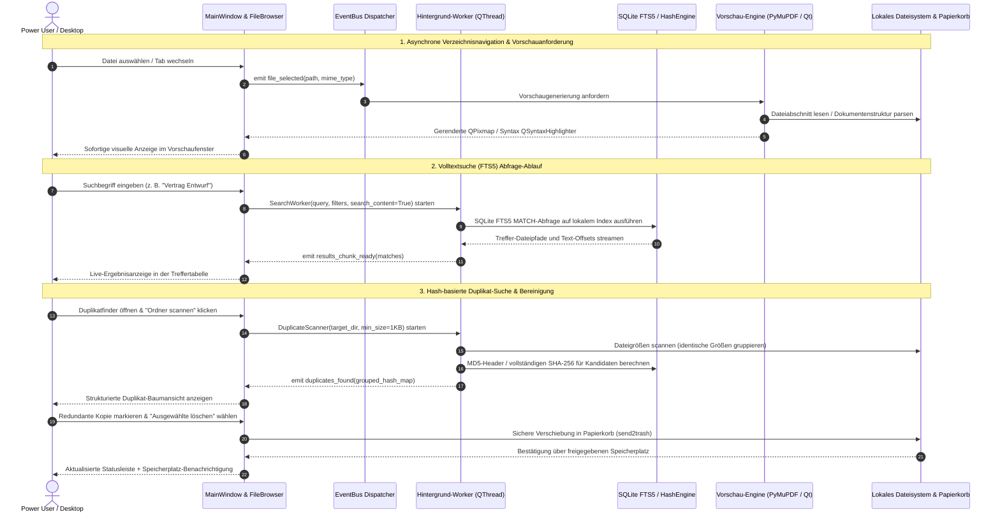

```mermaid
flowchart TD
    subgraph UI ["PySide6 Desktop UI-Schicht (Qt 6)"]
        MW["MainWindow\n(Docking, Toolbars, Menü, Sprachumschalter)"]
        TB["FileBrowser\n(Multi-Tab, _DnDTableView, Kontextmenü)"]
        PV["PreviewPanel\n(PyMuPDF PDF, Bilder, Markdown, Quellcode-View)"]
        SB["SidebarPanel\n(Verzeichnisbaum, Favoriten, App-Starter)"]
        QE["QuickEditor\n(Syntax-Highlighter, Zeilennummern, UTF-8-Schutz)"]
        DF["DuplicateFinderDialog\n(Kandidaten-Baum, Checkboxen, Diff-Ansicht)"]
        SP["SyncPanel\n(Quelle/Ziel-Paarung, Diff-Engine, Sync-Worker)"]
        PI["PrivacyIndicator\n(Ampel-Status, Barrierefreiheit/A11y-Hook)"]
    end

    subgraph Core ["Zentrale Anwendungsdienste"]
        EB["EventBus / Signal-Dispatcher\n(Entkoppelte signalbasierte Kommunikation)"]
        SM["SettingsManager\n(JSON-Konfiguration, %LOCALAPPDATA%-Isolation)"]
        TE["ThemeEngine & Palette\n(Dunkles/Helles Qt-Design, dynamische Icons)"]
        I18N["Translator & Lokalisierungskatalog\n(6 Sprachen: DE, EN, ES, ZH, JA, RU)"]
    end

    subgraph Engines ["Hintergrund-Engines & Analyse"]
        FTS["SQLite FTS5 Volltext-Engine\n(WAL-Modus, tokenisierter Inhaltsindex)"]
        HASH["HashEngine (MD5 / SHA-256)\n(Größengruppierung, Block-Hashing)"]
        PM["PrivacyMonitor\n(Regex-Blacklist-Engine, Secret-Wächter)"]
        SW["SearchWorker & ThreadPool\n(Asynchrone QThread-Ausführung)"]
    end

    subgraph Safety ["Dateisicherheits-Schicht"]
        FO["Sichere Dateioperationen\n(Papierkorb-Integration, OS-Safe Delete)"]
        CP["Kollisionsfreie Paste-Engine\n(Auto-Suffixe, Zero-Overwrite-Schutz)"]
        EXP["Workspace-Exporter\n(Anonymisiertes explorerpro-workspace-v1 JSON)"]
        LNK["Shortcut-Resolver\n(Windows .lnk Zielauflösung & Validierung)"]
    end

    subgraph Invariants ["Plattform- & Datenschutz-Invarianten"]
        ZERO["100% Offline / Zero-Egress\n(Keine Telemetrie, keine Cloud, keine Remote-APIs)"]
        NONELEV["Non-Elevation Standard-Benutzermodus\n(Ausführung strikt ohne Administrator-Rechte)"]
        MULTI["Plattformübergreifend Bereit\n(Windows primär / Linux & macOS Quellparität)"]
    end

    %% UI Verbindungen
    MW --> TB
    MW --> PV
    MW --> SB
    MW --> QE
    MW --> DF
    MW --> SP
    MW --> PI

    %% Core Verbindungen
    MW -.-> EB
    TB -.-> EB
    PV -.-> EB
    EB <--> SM
    EB <--> TE
    EB <--> I18N

    %% Engine Verbindungen
    TB --> SW
    SW --> FTS
    DF --> HASH
    TB --> PM
    PM --> PI

    %% Sicherheits-Verbindungen
    TB --> FO
    TB --> CP
    MW --> EXP
    PV --> LNK

    %% Invarianten-Wächter
    Core -.-> ZERO
    Engines -.-> NONELEV
    Safety -.-> MULTI
```

# ExplorerPro Suite

[English](README.md) | **[Deutsch](README_de.md)** | [Maschinenlesbarer Kontext (llms.txt)](llms.txt)

[](https://github.com/file-bricks/ExplorerPro/actions/workflows/ci.yml)
[](tests/)
[](https://www.python.org/)
[](https://github.com/file-bricks/ExplorerPro)
[-informational.svg)](src/gui/)
[](PRIVACY_POLICY.md)
[](SECURITY.md)
[](SECURITY.md)
[](THIRD_PARTY_LICENSES.md)
[](MARKETING-LOG.txt)
[](https://github.com/astral-sh/ruff)
[](LICENSE)
[](https://github.com/file-bricks)
[](https://github.com/open-bricks)
[](https://apps.microsoft.com/detail/9P0X52WSHZ3Q)
[](llms.txt)
[](CHANGELOG.md)

> [!NOTE]
> **Für KI-Agenten & LLMs:** Maschinenlesbarer Architekturkontext, Suchbegriffe, Laufzeitinvarianten und Verifikations-Befehle werden in [llms.txt](llms.txt) gepflegt.

> **ExplorerPro** ist ein moderner, datenschutzorientierter Desktop-Dateimanager und Power-User-Explorer für Windows, Linux und macOS. Er vereint Mehrtab-Dateinavigation, sofortige Mehrformat-Dateivorschau (PDF, Bilder, Quellcode mit Syntax-Highlighting, Markdown, Tabellenkalkulation), blitzschnelle SQLite-FTS5-Volltextsuche, Hash-basierte Duplikaterkennung, Datenschutz-Überwachung, Ordnersynchronisation und einen integrierten Quelltext-Editor in einer nativen PySide6-Anwendung (Qt 6).

---

## Schnellnavigation

1. [Überblick & Werteversprechen](#1-ueberblick--werteversprechen)
2. [Visuelle Showcase-Galerie](#2-visuelle-showcase-galerie)
3. [Systemarchitektur](#3-systemarchitektur)
4. [End-to-End Verarbeitungs-Lebenszyklus](#4-end-to-end-verarbeitungs-lebenszyklus)
5. [Governance- & Laufzeit-Invarianten](#5-governance---laufzeit-invarianten)
6. [Kernfähigkeiten & Mehrtab-Browser](#6-kernfaehigkeiten--mehrtab-browser)
7. [Integrierter Schnell-Editor & Synchronisation](#7-integrierter-schnell-editor--synchronisation)
8. [Universelle 6-Sprachen-Lokalisierung](#8-universelle-6-sprachen-lokalisierung)
9. [Tastaturkürzel](#9-tastaturkuerzel)
10. [Installation & Schnellstart](#10-installation--schnellstart)
11. [Microsoft Store & Paketierung](#11-microsoft-store--paketierung)
12. [Tests & Qualitäts-Gates](#12-tests--qualitaets-gates)
13. [Geschwister-Ökosystem & Integrationsmatrix](#13-geschwister-oekosystem--integrationsmatrix)
14. [Drittanbieter-Lizenzen & Transparenz](#14-drittanbieter-lizenzen--transparenz)
15. [Datenschutz, Sicherheit & Lizenz](#15-datenschutz-sicherheit--lizenz)

---

<a id="1-ueberblick--werteversprechen"></a>
## 1. Überblick & Werteversprechen

Standard-Dateimanager des Betriebssystems sind für oberflächliches Browsen gedacht und lassen Werkzeuge vermissen, die Entwickler, Forscher und Power User täglich benötigen. ExplorerPro schließt diese Lücke, indem es professionelle Produktivitätswerkzeuge in einer reaktionsschnellen Desktop-Oberfläche bündelt – mit null Telemetrie und 100% lokaler Local-First-Datenisolation.

- **Einheitliche Mehrtab-Erfahrung:** Paralleles Browsen in mehreren Verzeichnissen mit Tab-Fixierung, Breadcrumbs-Navigation, Drag-and-Drop und intelligenten Kontextmenüs.
- **Tiefgehende Datei-Inspektion:** Sofortige Direktanzeige für PDFs (PyMuPDF), Bilder, strukturierte Tabellen (pandas, openpyxl), Markdown und Quellcode-Dateien mit automatischer Syntaxerkennung.
- **Hochperformante FTS5-Volltextsuche:** Blitzschnelle Indexierung und Suche über Dateinamen und Dateiinhalte mittels eingebetteter SQLite-Volltextsuche mit WAL-Modus.
- **Exakte Duplikat-Eliminierung:** Zweistufige Analyse (Dateigrößen-Gruppierung + MD5/SHA-256 Block-Hashing) mit Gegenüberstellung und sicherem Recycling.
- **Datenschutz- & Blacklist-Wächter:** Kontinuierliche Ampel-Anzeige, die vor versehentlicher Offenlegung von Zugangsdaten, privaten Schlüsseln oder Blacklist-Mustern warnt.
- **Integrierter Editor & Sync-Tools:** Schnelle Quelltextbearbeitung mit Einrückungshilfen sowie unidirektionale oder spiegelnde Ordnersynchronisation mit Regex-Ausschlussregeln.
- **Vollständige 6-Sprachen-Lokalisierung:** Dynamische Benutzeroberfläche auf Deutsch, Englisch, Spanisch, Chinesisch, Japanisch und Russisch.

---

<a id="2-visuelle-showcase-galerie"></a>
## 2. Visuelle Showcase-Galerie

| Hauptfenster: Mehrtab-Browser & Vorschau | Erweiterte FTS5-Inhaltssuche |
| :---: | :---: |
|  |  |
| *Mehrtab-Dateibrowser mit Verzeichnisbaum, Favoriten, Statusleiste und Direktvorschau.* | *Sofortige Suchfilterung nach Name, Inhalt, Dateiendung und Änderungsdatum.* |

| Hash-basierter Duplikatfinder | Ordner-Synchronisationsmodul |
| :---: | :---: |
|  |  |
| *Gegenüberstellung identischer Dateigruppen mit Vorschau und sicherer Bereinigung.* | *Ordnerspiegelung und Differenzabgleich mit Regex-Ausschlüssen und Sicherheitsprotokoll.* |

---

<a id="3-systemarchitektur"></a>
## 3. Systemarchitektur

Das folgende Architekturdiagramm veranschaulicht den modularen Aufbau von ExplorerPro mit strikter Trennung von Präsentation, Hintergrund-Engines und Offline-First-Garantien:



---

<a id="4-end-to-end-verarbeitungs-lebenszyklus"></a>
## 4. End-to-End Verarbeitungs-Lebenszyklus

Das folgende Sequenzdiagramm illustriert den asynchronen Ablauf für Navigation, FTS5-Volltextsuche, Dateivorschau und Duplikatanalyse:



---

<a id="5-governance---laufzeit-invarianten"></a>
## 5. Governance- & Laufzeit-Invarianten

ExplorerPro garantiert über 10 verbindliche Governance- und Laufzeit-Invarianten maximale Datensicherheit, Integrität und Vorhersagbarkeit:

| Invarianten-ID | Name & Säule | Technische Umsetzung | Nutzen & Sicherheitsgewinn |
|---|---|---|---|
| **INV-LOCAL-01** | 100% Offline & Zero-Egress-Datenschutz | Rein lokale Ausführung (`src/core/`, `src/modules/`) | Keine offenen Netzwerk-Sockets; null Telemetrie oder Cloud-Zugriffe. |
| **INV-SEC-02** | Unprivilegierter RunAsInvoker-Betrieb | Standard-Benutzerberechtigungen | Keine UAC-Administratorabfragen oder Root-Rechte; unternehmenssicher. |
| **INV-SAFE-03** | Zerstörungsfreies Löschen & Papierkorb | Papierkorb-Integration mit Abbruch-Fokus | Versehentliche Löschungen ausgeschlossen; Dateien im Papierkorb wiederherstellbar. |
| **INV-PASTE-04** | Kollisionsfreies Einfügen ohne Überschreiben | Automatische Suffixe (`_copy`, `_copy_2`) | Einfügen überschreibt niemals stillschweigend bestehende Daten. |
| **INV-INDEX-05** | Sub-Sekunden SQLite-FTS5-Volltextindex | SQLite-WAL-Modus mit virtuellen FTS5-Tabellen | Lokale Volltextsuche über Tausende Dokumente in Millisekunden. |
| **INV-HASH-06** | 2-Phasen MD5/SHA-256 Duplikatbereinigung | Größengruppierung gefolgt von Block-Hashing | Schnelle und bit-exakte Duplikaterkennung ohne falsch-positive Treffer. |
| **INV-PRIV-07** | Proaktiver Regex-Datenschutzwächter | Ampel-Statusanzeige (`src/modules/privacy/`) | Warnt sofort vor versehentlich sichtbaren API-Keys, Passwörtern oder `.env`. |
| **INV-I18N-08** | Universelle 6-Sprachen-Parität | `locales/translations.json` (154 Schlüssel) | 100% lückenlose Übersetzungen über DE, EN, ES, ZH, JA, RU. |
| **INV-EXP-09** | Anonymisierter Workspace-Exportvertrag | `explorerpro-workspace-v1` Spezifikation | Exportierte Konfigurationen maskieren absolute Pfade, Benutzernamen und Secrets. |
| **INV-SLA-10** | 48-Stunden Reaktions- & 5-Tage-Triage-SLA | Zweisprachige Richtlinie in `SECURITY.md` | Schnelle koordinierte Schwachstellenbehandlung über GitHub Security Advisories. |

---

<a id="6-kernfaehigkeiten--mehrtab-browser"></a>
## 6. Kernfähigkeiten & Mehrtab-Browser

- **Dynamisches Tab-Management**: Mehrere Ordner in getrennten Reitern öffnen. Unterstützt Drag-and-Drop zur Neuordnung, Schließen per Mittelklick und automatisches Wiederherstellen beim nächsten Programmstart.
- **Breadcrumb- & Pfadnavigation**: Direkte Eingabezeile mit Auto-Vervollständigung neben interaktiven Breadcrumb-Schaltflächen zur schnellen Navigation in übergeordnete Verzeichnisse.
- **Sortierbare Detailansicht**: Schnelle Qt-Tabellenansicht mit Spaltensortierung nach Name, Dateiendung, Dateigröße, Änderungsdatum und Typ.
- **Integrierte Seitenleiste**: Schnellzugriff auf Laufwerke, angeheftete Favoriten, Standardordner (Desktop, Dokumente, Downloads) und anpassbare Anwendungsstarter.

---

<a id="7-integrierter-schnell-editor--synchronisation"></a>
## 7. Integrierter Schnell-Editor & Synchronisation

- **Integrierter Schnell-Editor (`QuickEditor`)**:
  - Eingebautes Syntax-Highlighting für Python, C/C++, JSON, XML, YAML und Markdown.
  - Zeilennummern, Einrückungshilfen, Suchen/Ersetzen-Leiste und automatischer UTF-8-Encoding-Schutz.
  - Skripte, Notizen und Konfigurationsdateien direkt im Explorer bearbeiten ohne externe Editoren.
- **Ordner-Synchronisation (`SyncPanel`)**:
  - Einweg-Spiegelung und bidirektionaler Abgleich.
  - Differenzielle Trockenlauf-Vorschau mit Zeitstempel- und Größenvergleich vor der eigentlichen Durchführung.
  - Regex-basierte Ausschlussfilter für `.git`, `__pycache__`, `.venv` und Node-Module.

---

<a id="8-universelle-6-sprachen-lokalisierung"></a>
## 8. Universelle 6-Sprachen-Lokalisierung

ExplorerPro bietet native Übersetzungen für 6 Sprachen:

- **Deutsch (de)** — Vollständige deutsche Benutzeroberfläche und Meldungen
- **English (en)** — Internationale Referenzsprache
- **Español (es)** — Spanische Lokalisierung
- **中文 (zh)** — Vereinfachtes Chinesisch
- **日本語 (ja)** — Japanische Lokalisierung
- **Русский (ru)** — Russische Lokalisierung

Die Sprache kann im Einstellungsdialog unter **Einstellungen -> Allgemein** jederzeit im laufenden Betrieb umgeschaltet werden.

---

<a id="9-tastaturkuerzel"></a>
## 9. Tastaturkürzel

ExplorerPro bietet eine vollständige Tastatursteuerung für effizientes Arbeiten:

| Tastenkürzel | Kontext | Aktion |
|---|---|---|
| <kbd>Strg</kbd> + <kbd>N</kbd> | Global | Neues ExplorerPro-Fenster öffnen |
| <kbd>Strg</kbd> + <kbd>T</kbd> | Browser | Neuen Verzeichnis-Tab öffnen |
| <kbd>Strg</kbd> + <kbd>W</kbd> | Browser | Aktiven Tab schließen |
| <kbd>Strg</kbd> + <kbd>Tab</kbd> | Browser | Durch geöffnete Tabs wechseln |
| <kbd>Strg</kbd> + <kbd>F</kbd> | Global | Suchleiste fokussieren und FTS5-Suche auslösen |
| <kbd>F2</kbd> | Browser | Ausgewählte Datei oder Ordner umbenennen |
| <kbd>Entf</kbd> | Browser | Ausgewählte Elemente löschen (mit Bestätigung) |
| <kbd>Strg</kbd> + <kbd>C</kbd> | Browser | Dateien/Ordner in die Zwischenablage kopieren |
| <kbd>Strg</kbd> + <kbd>V</kbd> | Browser | Dateien einfügen (mit kollisionsfreiem Auto-Suffix) |
| <kbd>Strg</kbd> + <kbd>Umschalt</kbd> + <kbd>N</kbd> | Browser | Neuen Ordner im aktuellen Verzeichnis anlegen |
| <kbd>F5</kbd> | Global | Aktuelle Ansicht und Dateivorschau aktualisieren |
| <kbd>Alt</kbd> + <kbd>Links</kbd> | Browser | Im Verlauf zurück navigieren |
| <kbd>Alt</kbd> + <kbd>Rechts</kbd> | Browser | Im Verlauf vorwärts navigieren |
| <kbd>Alt</kbd> + <kbd>Auf</kbd> | Browser | In den übergeordneten Ordner wechseln |
| <kbd>Strg</kbd> + <kbd>,</kbd> | Global | Anwendungs-Einstellungen öffnen (5 Reiter) |
| <kbd>Strg</kbd> + <kbd>Q</kbd> | Global | Anwendung sicher beenden |

---

<a id="10-installation--schnellstart"></a>
## 10. Installation & Schnellstart

### Voraussetzungen

- **Python 3.10, 3.11 oder 3.12**
- Betriebssystem: Windows 10/11, Linux (Ubuntu, Debian, Fedora, Arch) oder macOS (12+)

### Repository klonen und Umgebung einrichten

```bash
# 1. Repository klonen
git clone https://github.com/file-bricks/ExplorerPro.git
cd ExplorerPro

# 2. Virtuelle Umgebung anlegen und aktivieren
python -m venv .venv

# Unter Windows:
.venv\Scripts\activate

# Unter Linux / macOS:
source .venv/bin/activate

# 3. Produktions-Abhängigkeiten installieren
pip install -r requirements.txt
```

### ExplorerPro starten

```bash
# Direkter Start via Python:
python src/main.py

# Windows Schnellstart-Skript:
START_ExplorerPro.bat
```

---

<a id="11-microsoft-store--paketierung"></a>
## 11. Microsoft Store & Paketierung

ExplorerPro ist offiziell im Microsoft Store unter der Paket-Identität `Geiger.ExplorerPro` veröffentlicht (Store-ID: `9P0X52WSHZ3Q`).

Store-Preflight-Prüfungen lokal ausführen:

```bash
# Store-Readiness-Audit prüfen (Icons, Manifeste, Screenshots):
python scripts/check_store_readiness.py

# Redigierte hochauflösende Screenshots regenerieren:
python generate_store_screenshots.py
```

Store-Dokumentation:
- [STORE_LISTING.md](STORE_LISTING.md) — Offizielle Store-Texte und Lokalisierungen.
- [WINDOWS_STORE_PREP.md](WINDOWS_STORE_PREP.md) — MSIX-Paketierungsschritte und Manifest-Layout.
- [SUPPORT.md](SUPPORT.md) — Support-Kontakt und Fehlerbehandlung.

---

<a id="12-tests--qualitaets-gates"></a>
## 12. Tests & Qualitäts-Gates

ExplorerPro setzt auf strikte automatisierte Vertragstests und Multi-OS CI-Validierung:

```bash
# Komplette automatisierte Testsuite ausführen (230+ Tests):
python -m pytest -q

# Bytecode-Kompilierung über alle Module verifizieren:
python -m compileall -q src tests manage_translations.py translator.py

# Statische Code-Analyse und Hygiene prüfen:
python -m ruff check .

# Plattformübergreifenden Desktop-Smoketest ausführen:
python tests/source_platform_smoke.py

# Übersetzungsabdeckung über 6 Sprachen prüfen:
python manage_translations.py .
```

### CI-Matrix-Status

Jeder Commit und Pull Request wird automatisiert per [GitHub Actions CI](.github/workflows/ci.yml) geprüft:
- **Betriebssysteme:** `windows-latest`, `ubuntu-latest`, `macos-latest`
- **Python-Versionen:** `3.10`, `3.11`, `3.12`
- **Qualitäts-Gates:** `compileall`, `ruff check .`, `pytest` (im Offscreen-Modus) und `source_platform_smoke.py`.

---

<a id="13-geschwister-oekosystem--integrationsmatrix"></a>
## 13. Geschwister-Ökosystem & Integrationsmatrix

ExplorerPro ist Teil der **open-bricks** Open-Source-Familie und kooperiert mit komplementären Desktop-Werkzeugen und MCP-Infrastrukturen:

| Repository | Organisation | Schwerpunkt | Parität & Integration |
|---|---|---|---|
| [ProFiler](https://github.com/file-bricks/ProFiler) | `file-bricks` | Batch-Dateianalyse & Metadaten-Kategorisierung | Komplementärer Metadaten-Kategorisierer |
| [ProSync](https://github.com/file-bricks/ProSync) | `file-bricks` | Leistungsstarke Ordner-Synchronisation | Standalone-Synchronisationswerkzeug |
| [SQLiteViewer](https://github.com/file-bricks/SQLiteViewer) | `file-bricks` | Visueller SQLite-Inspektor | Direkter Inspektor für ExplorerPro FTS5-Datenbanken |
| [SoftwareCenter](https://github.com/file-bricks/SoftwareCenter) | `file-bricks` | Lokaler Software-Bestand & Anwendungsstarter | Ökosystem-Starter und Update-Hub |
| [CloudLockFixer](https://github.com/file-bricks/CloudLockFixer) | `file-bricks` | Reparatur von Windows Cloud-Locks & Sync-Status | Entsperrt blockierte OneDrive/Nextcloud-Dateien |
| [WinStorePackager](https://github.com/file-bricks/WinStorePackager) | `file-bricks` | Automatisierte MSIX-Paketierung & WACK-Tools | Paketierungs-Toolchain für Store-Releases |
| [DokuZen](https://github.com/doc-bricks/DokuZen) | `doc-bricks` | Dokumentenmanagement & Schwärzung | OCR-Erkennung & dauerhafte Schwärzung |
| [FormularErstellen](https://github.com/doc-bricks/FormularErstellen) | `doc-bricks` | Formular-Erstellung & PDF-Generierung | Standardisierter Formular-Generator |
| [CleanMarkdown](https://github.com/doc-bricks/CleanMarkdown) | `doc-bricks` | Markdown-Bereinigung & Formatierung | Formatiert in ExplorerPro angezeigte Dokumente |
| [PDFtoPDFocr](https://github.com/doc-bricks/PDFtoPDFocr) | `doc-bricks` | Durchsuchbare PDFs per OCR erzeugen | Bereitet Scans für ExplorerPro FTS5-Suche auf |
| [FAST_PDFSchwaerzerPro](https://github.com/doc-bricks/FAST_PDFSchwaerzerPro) | `doc-bricks` | Sichere PDF-Schwärzung | Dauerhafte Schwärzung vertraulicher Dateien |
| [CodeBox](https://github.com/dev-bricks/CodeBox) | `dev-bricks` | Mehrsprachiger Code-Editor & IDE | Entwickler-IDE für komplexe Projekte |
| [DevCenter](https://github.com/dev-bricks/DevCenter) | `dev-bricks` | Entwickler-Werkbank & Konverter | Konvertiert Dateien für die Direktanzeige |
| [MethodenAnalyser](https://github.com/dev-bricks/MethodenAnalyser) | `dev-bricks` | Statische Code-Analyse & Metriken | Analysiert Quelltexte gefundener Repositories |
| [automizer-for-claude-desktop](https://github.com/dev-bricks/automizer-for-claude-desktop) | `dev-bricks` | Desktop-Aufgabenwarteschlange & Automation | Agenten-Integration und Workflow-Automatisierung |
| [ellmos-controlcenter-mcp](https://github.com/ellmos-ai/ellmos-controlcenter-mcp) | `ellmos-ai` | Model Context Protocol Gateway & Routing | MCP-Gateway für KI-Agenten und Workflows |
| [open-bricks](https://github.com/open-bricks) | `open-bricks` | Dachorganisation & Repository-Katalog | Zentrales Portal für alle Open-Source-Werkzeuge |

---

<a id="14-drittanbieter-lizenzen--transparenz"></a>
## 14. Drittanbieter-Lizenzen & Transparenz

ExplorerPro nutzt ausschließlich geprüfte, freie Open-Source-Bibliotheken. Das vollständige Lizenzinventar ist in [THIRD_PARTY_LICENSES.md](THIRD_PARTY_LICENSES.md) und [THIRD_PARTY_LICENSES.txt](THIRD_PARTY_LICENSES.txt) dokumentiert:

- **PySide6 (Qt 6)**: LGPL-3.0-only (Dynamisch verknüpfte Shared Libraries; keine Qt-Modifikationen)
- **PyMuPDF (`fitz`)**: AGPL-3.0-only / Kommerziell (100% konform mit ExplorerPros AGPL-3.0-Lizenz)
- **pandas**: BSD-3-Clause (Strukturierte Tabellenverarbeitung & CSV-Analyse)
- **openpyxl**: MIT (Excel-Dateianalyse)
- **PyInstaller**: GPL-2.0-or-later mit Ausnahme (Build-Paketierung für Standalone-Executable)
- **pytest / ruff / setuptools**: MIT / Apache-2.0 (Qualitätssicherungs- und Linting-Werkzeuge)

Strategische Marketing-Analysen, Suchbegriffe und Zielgruppen-Personas sind in [MARKETING-LOG.txt](MARKETING-LOG.txt) festgehalten.

---

<a id="15-datenschutz-sicherheit--lizenz"></a>
## 15. Datenschutz, Sicherheit & Lizenz

ExplorerPro ist Open-Source-Software unter der **GNU Affero General Public License v3 (AGPL-3.0)**. Die vollständigen Lizenzbedingungen sind in der Datei [LICENSE](LICENSE) enthalten.

### Datenschutz- & Sicherheitsgarantien

- **Kein Datenabfluss (Zero-Egress)**: 100% offline; null Telemetrie, Tracking oder Cloud-Kommunikation. Siehe [PRIVACY_POLICY.md](PRIVACY_POLICY.md).
- **RunAsInvoker-Sicherheit**: Läuft ausschließlich im unprivilegierten Standard-Benutzermodus ohne Administratorrechte.
- **Sicherheits-SLA**: Meldungen zu Sicherheitslücken werden mit einer 48-Stunden-Reaktions- und 5-Tage-Triage-Garantie bearbeitet. Richtlinie in [SECURITY.md](SECURITY.md).

### Haftungsausschluss / Disclaimer

Dieses Projekt wird unentgeltlich als Open-Source-Software bereitgestellt. Nutzung auf eigenes Risiko. Es gibt keine Wartungszusage, Verfügbarkeitsgarantie, Gewähr für Fehlerfreiheit oder Eignung für einen bestimmten Zweck.

*This project is provided as unpaid open-source software. Use it at your own risk. No warranty, maintenance promise, availability guarantee, or fitness for a particular purpose is assumed.*
