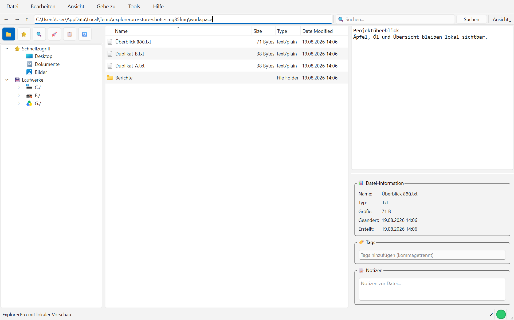
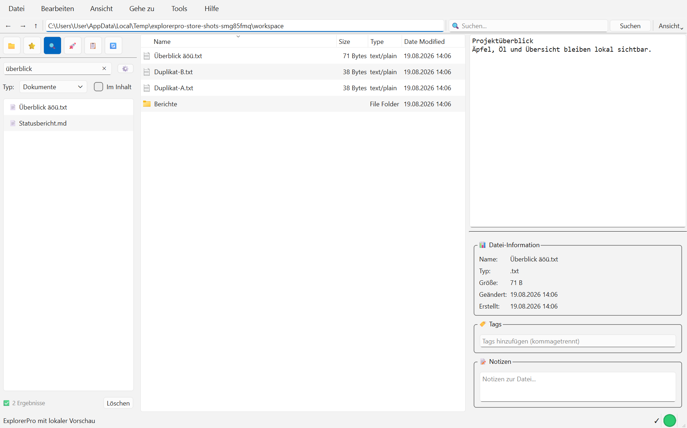
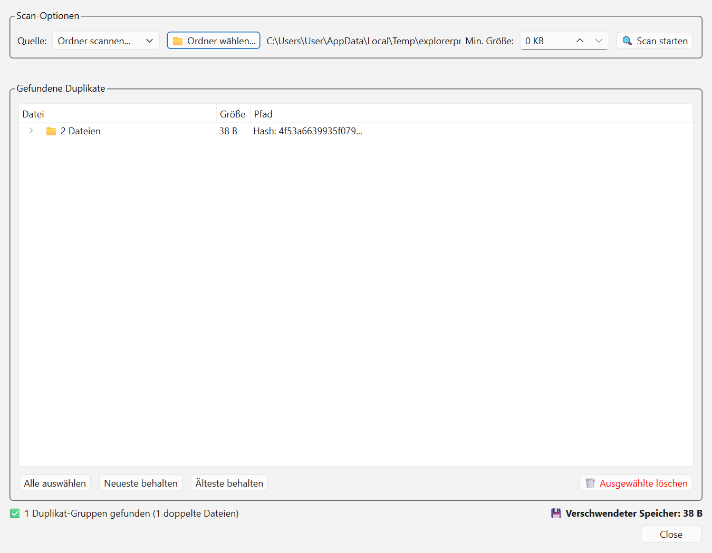
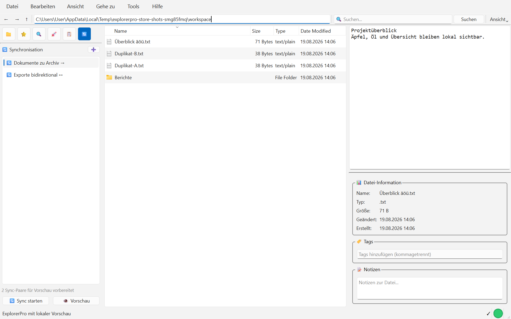
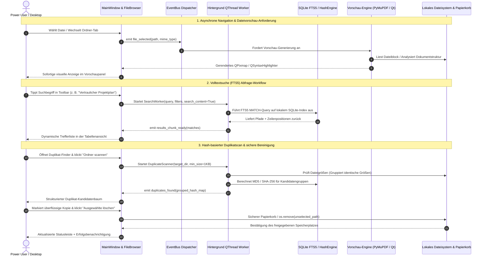

# ExplorerPro Suite

[English](README.md) | **[Deutsch](README_de.md)** | [Maschinenlesbarer Kontext (llms.txt)](llms.txt)

[](https://github.com/file-bricks/ExplorerPro/actions/workflows/ci.yml)
[](tests/)
[](https://www.python.org/)
[](https://github.com/file-bricks/ExplorerPro)
[-informational.svg)](src/gui/)
[](PRIVACY_POLICY.md)
[](SECURITY.md)
[](LICENSE)
[](https://github.com/file-bricks)
[](https://github.com/open-bricks)
[](https://apps.microsoft.com/detail/9P0X52WSHZ3Q)
[](llms.txt)
[](CHANGELOG.md)

> [!NOTE]
> **Für KI-Agenten & LLMs:** Maschinenlesbarer Architekturkontext, Suchbegriffe, Laufzeitinvarianten und Verifikations-Befehle werden in [llms.txt](llms.txt) gepflegt.

> **ExplorerPro** ist ein moderner, datenschutzorientierter Desktop-Dateimanager und Power-User-Explorer für Windows, Linux und macOS. Er vereint Mehrtab-Dateinavigation, sofortige Mehrformat-Dateivorschau (PDF, Bilder, Quellcode mit Syntax-Highlighting, Markdown), blitzschnelle SQLite-FTS5-Volltextsuche, Hash-basierte Duplikaterkennung, Datenschutz-Überwachung, Ordnersynchronisation und einen integrierten Quelltext-Editor in einer nativen PySide6-Anwendung (Qt 6).

---

## Schnellnavigation

- [Überblick & Kernnutzen](#überblick--kernnutzen)
- [Visuelle Showcase-Galerie](#visuelle-showcase-galerie)
- [Systemarchitektur](#systemarchitektur)
- [End-to-End Verarbeitungs-Lebenszyklus](#end-to-end-verarbeitungs-lebenszyklus)
- [Kernfähigkeiten & Laufzeitinvarianten](#kernfähigkeiten--laufzeitinvarianten)
- [Tastaturkürzel](#tastaturkürzel)
- [Installation & Schnellstart](#installation--schnellstart)
- [Microsoft Store & Paketierung](#microsoft-store--paketierung)
- [Testsuite & Qualitäts-Gates](#testsuite--qualitäts-gates)
- [Datenschutz & Sicherheit](#datenschutz--sicherheit)
- [Geschwister-Ökosystem](#geschwister-ökosystem)
- [Lizenz & Haftungsausschluss](#lizenz--haftungsausschluss)

---

## Überblick & Kernnutzen

Standard-Dateimanager des Betriebssystems sind für oberflächliches Browsen gedacht und lassen Werkzeuge vermissen, die Entwickler, Forscher und Power User täglich benötigen. ExplorerPro schließt diese Lücke, indem es professionelle Produktivitätswerkzeuge in einer reaktionsschnellen Desktop-Oberfläche bündelt – mit null Telemetrie und 100% lokaler Datenisolation.

- **Einheitliche Mehrtab-Erfahrung:** Paralleles Browsen in mehreren Verzeichnissen mit Tab-Fixierung, Breadcrumbs-Navigation, Drag-and-Drop und intelligenten Kontextmenüs.
- **Tiefgehende Datei-Inspektion:** Sofortige Direktanzeige für PDFs (PyMuPDF), Bilder, strukturierte Tabellen, Markdown und Quellcode-Dateien mit automatischer Syntaxerkennung.
- **Hochperformante FTS5-Volltextsuche:** Blitzschnelle Indexierung und Suche über Dateinamen und Dateiinhalte mittels eingebetteter SQLite-Volltextsuche.
- **Exakte Duplikat-Eliminierung:** Zweistufige Analyse (Dateigrößen-Gruppierung + MD5/SHA-256 Block-Hashing) mit Gegenüberstellung und sicherem Recycling.
- **Datenschutz- & Blacklist-Wächter:** Kontinuierliche Ampel-Anzeige, die vor versehentlicher Offenlegung von Zugangsdaten, privaten Schlüsseln oder Blacklist-Mustern warnt.
- **Integrierter Editor & Sync-Tools:** Schnelle Quelltextbearbeitung mit Einrückungshilfen sowie unidirektionale oder spiegelnde Ordnersynchronisation mit Regex-Ausschlussregeln.
- **Vollständige 6-Sprachen-Lokalisierung:** Dynamische Benutzeroberfläche auf Deutsch, Englisch, Spanisch, Chinesisch, Japanisch und Russisch.

---

## Visuelle Showcase-Galerie

| Mehrtab-Explorer & Vorschaupanel | Erweiterte FTS5-Inhaltssuche |
| :---: | :---: |
|  |  |
| *Mehrtab-Navigation mit Verzeichnisbaum, Favoriten, Statusleiste und Direktvorschau.* | *Sofortige Suchfilterung nach Dateinamen, Inhalten, Dateitypen und Änderungsdaten.* |

| Hash-basierter Duplikat-Finder | Ordnersynchronisations-Engine |
| :---: | :---: |
|  |  |
| *Gegenüberstellung identischer Dateigruppen mit Vorschau und sicherer Stapellöschung.* | *Ordnerspiegelung und differenzielle Synchronisation mit Filtern und Sicherheitsprotokoll.* |

---

## Systemarchitektur

Das folgende Diagramm veranschaulicht die Schichtenarchitektur von ExplorerPro mit entkoppelter Benutzeroberfläche, asynchronen Hintergrund-Engines und lokalen Sicherheitsinvarianten:

```mermaid
flowchart TD
    subgraph UI ["PySide6 Desktop-UI-Schicht (Qt 6)"]
        MW["MainWindow\n(Docking, Toolbars, Menü, Sprachumschaltung)"]
        TB["FileBrowser\n(Mehrtab, _DnDTableView, Kontextmenü)"]
        PV["PreviewPanel\n(PyMuPDF PDF, Bilder, Markdown, Syntax-Ansicht)"]
        SB["SidebarPanel\n(Verzeichnisbaum, Favoriten, App-Launcher)"]
        QE["QuickEditor\n(Syntax-Highlighter, Zeilennummern, UTF-8-Schutz)"]
        DF["DuplicateFinderDialog\n(Kandidatenbaum, Checkboxen, Diff-Ansicht)"]
        SP["SyncPanel\n(Quell-/Zielpaarung, Diff-Engine, Sync-Worker)"]
        PI["PrivacyIndicator\n(Ampel-Statusleiste, Barrierefreie A11y-Hooks)"]
    end

    subgraph Core ["Zentrale Anwendungsdienste"]
        EB["EventBus / Signal-Dispatcher\n(Entkoppelte Komponenten-Kommunikation)"]
        SM["SettingsManager\n(JSON-Konfiguration, %LOCALAPPDATA%-Isolation)"]
        TE["ThemeEngine & Palette\n(Dunkle/Helle Qt-Themes, dynamische Icons)"]
        I18N["Translator & i18n-Katalog\n(6 Sprachen: DE, EN, ES, ZH, JA, RU)"]
    end

    subgraph Engines ["Hintergrund-Indexierung & Analyse-Engines"]
        FTS["SQLite FTS5 Volltext-Engine\n(WAL-Modus, tokenisierter Inhaltsindex)"]
        HASH["HashEngine (MD5 / SHA-256)\n(Größengruppierung, Blockweises Hashing)"]
        PM["PrivacyMonitor\n(Regex-Blacklist-Engine, Sensible Datei-Wächter)"]
        SW["SearchWorker & ThreadPool\n(Asynchrone QThread-Ausführung)"]
    end

    subgraph Safety ["Dateioperationen & Sicherheitswächter"]
        FO["Sichere Dateioperationen\n(Papierkorb-Integration, sicheres Löschen)"]
        CP["Kollisionsfreies Einfügen\n(Auto-Suffixing, Überschreibschutz)"]
        EXP["Workspace-Exporter\n(Sanitisiertes explorerpro-workspace-v1 JSON)"]
        LNK["Shortcut-Resolver\n(Windows .lnk Zielauflösung & Prüfung)"]
    end

    subgraph Invariants ["Plattform- & Datenschutz-Invarianten"]
        ZERO["100% Offline / Zero-Egress\n(Keine Telemetrie, keine Cloud, 0 Remote-APIs)"]
        NONELEV["Unprivilegierter User-Mode\n(Läuft strikt ohne Administratorrechte)"]
        MULTI["Plattformübergreifend bereit\n(Windows Primär / Linux & macOS Quellparität)"]
    end

    %% UI Verbindungen
    MW --> TB
    MW --> PV
    MW --> SB
    MW --> QE
    MW --> DF
    MW --> SP
    MW --> PI

    %% Kern-Dienste Verbindungen
    MW -.-> EB
    TB -.-> EB
    PV -.-> EB
    EB <--> SM
    EB <--> TE
    EB <--> I18N

    %% Engine Verbindungen
    TB --> SW
    SW --> FTS
    DF --> HASH
    TB --> PM
    PM --> PI

    %% Sicherheits-Verbindungen
    TB --> FO
    TB --> CP
    MW --> EXP
    PV --> LNK

    %% Invarianten Wächter
    Core -.-> ZERO
    Engines -.-> NONELEV
    Safety -.-> MULTI
```



---

## End-to-End Verarbeitungs-Lebenszyklus

Das Sequenzdiagramm illustriert den asynchronen Ablauf bei Navigation, FTS5-Volltextsuche, Vorschaugenerierung und sicherer Duplikaterkennung:



---

## Kernfähigkeiten & Laufzeitinvarianten

| Fähigkeit / Invariante | Technische Umsetzung | Garantie & Nutzen |
|---|---|---|
| **Local-First & Zero-Egress** | Reine lokale Laufzeit (`src/core/`, `src/modules/`) | **100% Offline**. Keine Telemetrie, keine Analyse-Dienste, null Netzwerk-Egress. |
| **Unprivilegierter User-Mode** | Standard-Benutzerrechte (Non-Elevation) | Verlangt niemals Administratorrechte. Sicher in Unternehmensumgebungen einsetzbar. |
| **Mehrtab-Dateibrowser** | PySide6 `QTableView` + `_DnDTableView` | Tab-Fixierung, Breadcrumbs-Leiste, Drag-and-Drop, sortierbare Spalten und Kontextmenüs. |
| **Mehrformat-Vorschau** | PyMuPDF (`fitz`), Pillow, PySide6 | Schnelle Vorschau für PDF, PNG, JPEG, SVG, Markdown, JSON, YAML und Quellcode-Dateien. |
| **SQLite FTS5 Volltextsuche** | SQLite WAL-Modus + FTS5 Virtuelle Tabellen | Subsekunden-Suche über tausende lokale Dokumente nach Namen und Inhalten. |
| **Hash-basierter Duplikat-Finder** | 2-Phasen MD5/SHA-256 Hashing | Bereinigt Speicherplatz durch exakte Duplikaterkennung mit Vorschau und Recycling. |
| **Datenschutz- & Blacklist-Monitor** | Regex-Musterwächter (`src/modules/privacy/`) | Echtzeit-Ampelanzeige bei Erkennung sensibler Zugangsdaten, `.env`-Dateien oder Mustern. |
| **Integrierter Schnell-Editor** | QPlainTextEdit + SyntaxHighlighter | Zügige Bearbeitung mit Syntax-Highlighting für Python, C/C++, JSON, XML, Markdown. |
| **Ordnersynchronisation** | Differenzielle Sync-Engine (`src/modules/sync/`) | Lokale Verzeichnisspiegelung mit Ausschlussregeln, Diff-Vorschau und Protokollierung. |
| **Sanitärer Workspace-Export** | `explorerpro-workspace-v1` Standard | Schließt absolute Systempfade und Zugangsdaten beim Export von Konfigurationen aus. |
| **Universelle 6-Sprachen-i18n** | `locales/translations.json` | 100% übersetzt in Deutsch, Englisch, Spanisch, Chinesisch, Japanisch und Russisch. |
| **Barrierefreiheit (A11y)** | Barrierefreie Qt-Widgets & Tastaturfokus | Screen-Reader-Beschreibungen, kontrastreiche Paletten und umfassende Tastatursteuerung. |

---

## Tastaturkürzel

ExplorerPro bietet eine vollständige Tastatursteuerung für maximale Effizienz beim täglichen Arbeiten:

| Tastenkürzel | Kontext | Aktion |
|---|---|---|
| <kbd>Strg</kbd> + <kbd>N</kbd> | Global | Neues ExplorerPro-Fenster öffnen |
| <kbd>Strg</kbd> + <kbd>T</kbd> | Browser | Neuen Verzeichnis-Tab öffnen |
| <kbd>Strg</kbd> + <kbd>W</kbd> | Browser | Aktiven Tab schließen |
| <kbd>Strg</kbd> + <kbd>Tab</kbd> | Browser | Durch geöffnete Tabs wechseln |
| <kbd>Strg</kbd> + <kbd>F</kbd> | Global | Suchleiste fokussieren und FTS5-Suche starten |
| <kbd>F2</kbd> | Browser | Ausgewählte Datei oder Ordner umbenennen |
| <kbd>Entf</kbd> | Browser | Ausgewählte Elemente löschen (mit Bestätigungsdialog) |
| <kbd>Strg</kbd> + <kbd>C</kbd> | Browser | Ausgewählte Dateien in Zwischenablage kopieren |
| <kbd>Strg</kbd> + <kbd>V</kbd> | Browser | Dateien aus Zwischenablage einfügen (kollisionsfreies Auto-Suffix) |
| <kbd>Strg</kbd> + <kbd>Umschalt</kbd> + <kbd>N</kbd> | Browser | Neuen Ordner im aktuellen Verzeichnis erstellen |
| <kbd>F5</kbd> | Global | Verzeichnisansicht und Vorschau aktualisieren |
| <kbd>Alt</kbd> + <kbd>Links</kbd> | Browser | Im Ordnerverlauf zurückgehen |
| <kbd>Alt</kbd> + <kbd>Rechts</kbd> | Browser | Im Ordnerverlauf vorwärtsgehen |
| <kbd>Alt</kbd> + <kbd>Hoch</kbd> | Browser | In übergeordnetes Verzeichnis wechseln |
| <kbd>Strg</kbd> + <kbd>,</kbd> | Global | Einstellungsdialog öffnen (5 Tabs) |
| <kbd>Strg</kbd> + <kbd>Q</kbd> | Global | Anwendung sicher beenden |

---

## Installation & Schnellstart

### Voraussetzungen

- **Python 3.10, 3.11 oder 3.12**
- Betriebssystem: Windows 10/11, Linux (Ubuntu, Debian, Fedora, Arch) oder macOS (12+)

### Repository klonen & Umgebung einrichten

```bash
# 1. Repository klonen
git clone https://github.com/file-bricks/ExplorerPro.git
cd ExplorerPro

# 2. Virtuelle Umgebung erstellen und aktivieren
python -m venv .venv

# Unter Windows:
.venv\Scripts\activate

# Unter Linux / macOS:
source .venv/bin/activate

# 3. Produktions-Abhängigkeiten installieren
pip install -r requirements.txt
```

### ExplorerPro starten

```bash
# Direkter Start via Python:
python src/main.py

# Windows Schnellstarter-Skript:
START_ExplorerPro.bat
```

---

## Microsoft Store & Paketierung

ExplorerPro ist offiziell im Microsoft Store unter der Paket-Identität `Geiger.ExplorerPro` veröffentlicht (Store-ID: `9P0X52WSHZ3Q`).

Lokale Store-Readiness-Prüfung ausführen:

```bash
# Store-Readiness Validierung prüfen (Icons, Manifeste, Screenshots):
python scripts/check_store_readiness.py

# Hochauflösende redigierte Store-Screenshots reproduzieren:
python generate_store_screenshots.py
```

Store-Dokumentation:
- [STORE_LISTING.md](STORE_LISTING.md) — Offizielle Store-Texte und lokalisierte Beschreibungen.
- [WINDOWS_STORE_PREP.md](WINDOWS_STORE_PREP.md) — MSIX-Paketierungsanleitung und Manifestaufbau.
- [SUPPORT.md](SUPPORT.md) — Support-Kontakte und Fehlerberichte.

---

## Testsuite & Qualitäts-Gates

ExplorerPro setzt strenge Qualitäts-Gates, automatisierte Vertragstests und Multi-OS CI-Verifikation ein:

```bash
# Vollständige Testsuite ausführen (215+ Tests):
python -m pytest -q

# Bytecode-Kompilierung über alle Module prüfen:
python -m compileall -q src tests manage_translations.py translator.py

# Statische Code-Hygiene und Linting:
python -m ruff check .

# Plattformübergreifenden Desktop-Smoketest ausführen:
python tests/source_platform_smoke.py

# 6-Sprachen-Übersetzungsabdeckung validieren:
python manage_translations.py .
```

### CI-Matrix Status

Jeder Commit und Pull Request wird automatisiert über [GitHub Actions CI](.github/workflows/ci.yml) validiert:
- **Betriebssysteme:** `windows-latest`, `ubuntu-latest`, `macos-latest`
- **Python-Versionen:** `3.10`, `3.11`, `3.12`
- **Qualitäts-Gates:** `compileall`, `ruff check .`, `pytest` Offscreen-Suite und `source_platform_smoke.py`.

---

## Datenschutz & Sicherheit

ExplorerPro verfolgt kompromisslose Datenschutz- und Sicherheitsstandards:

- **100% Offline-Garantie:** Zur Laufzeit werden keinerlei Netzwerk-Sockets geöffnet. ExplorerPro verbindet sich niemals mit externen Servern, Clouds oder Analyse-Diensten.
- **Destruktiver Schutz:** Löschvorgänge öffnen stets einen modalen Bestätigungsdialog mit Vorbelegung auf *Abbrechen*. Das Einfügen von Dateien überschreibt niemals stillschweigend bestehende Daten, sondern vergibt kollisionsfreie Suffixe (`_copy`, `_copy_2`).
- **Datenschutzerklärung:** Siehe [PRIVACY_POLICY.md](PRIVACY_POLICY.md).
- **Sicherheitsrichtlinie:** Zweisprachiger Leitfaden und direkte Sicherheitskontakte in [SECURITY.md](SECURITY.md).

---

## Geschwister-Ökosystem

ExplorerPro ist Teil der **open-bricks** Open-Source-Familie und arbeitet harmonisch mit verwandten Desktop-Werkzeugen und MCP-Infrastrukturen zusammen:

| Repository | Organisation | Domäne / Schwerpunkt | Integration & Parität |
|---|---|---|---|
| [ProFiler](https://github.com/file-bricks/ProFiler) | `file-bricks` | Stapel-Metadatenanalyse & Datei-Kategorisierung | Partner-Engine für Dateikategorisierung |
| [ProSync](https://github.com/file-bricks/ProSync) | `file-bricks` | Hochperformante Ordnersynchronisation | Eigenständige Verzeichnissynchronisation |
| [SQLiteViewer](https://github.com/file-bricks/SQLiteViewer) | `file-bricks` | Visueller SQLite-Inspektor & Tabellen-Manager | Direkter Inspektor für FTS5-Suchdatenbanken |
| [SoftwareCenter](https://github.com/file-bricks/SoftwareCenter) | `file-bricks` | Lokales Software-Inventar & App-Starter | Zentraler Ökosystem-Starter |
| [WinStorePackager](https://github.com/file-bricks/WinStorePackager) | `file-bricks` | Automatisierte MSIX Store-Paketierung & WACK-Tools | Toolchain-Paketierer für Store-Releases |
| [DokuZen](https://github.com/doc-bricks/DokuZen) | `doc-bricks` | Dokumentenmanagement & destruktive Schwärzung | Partner für OCR & permanente PDF-Schwärzung |
| [FormularErstellen](https://github.com/doc-bricks/FormularErstellen) | `doc-bricks` | Dynamische Formularerstellung & PDF-Generierung | Standardisierter PDF-Formulargenerator |
| [CodeBox](https://github.com/dev-bricks/CodeBox) | `dev-bricks` | Mehrsprachiger Quelltext-Editor & Mini-IDE | Entwickler-IDE für komplexe Quelltexte |
| [automizer-for-claude-desktop](https://github.com/dev-bricks/automizer-for-claude-desktop) | `dev-bricks` | Desktop-Aufgabenwarteschlange & Prozessautomatisierung | Desktop-Agenten-Automatisierung |
| [ellmos-controlcenter-mcp](https://github.com/ellmos-ai/ellmos-controlcenter-mcp) | `ellmos-ai` | Model Context Protocol Gateway & Routing | MCP-Gateway für KI-Werkzeuge |
| [open-bricks](https://github.com/open-bricks) | `open-bricks` | Dachorganisation & Gesamtübersicht | Zentrales Portal für alle Open-Source-Tools |

---

## Lizenz & Haftungsausschluss

ExplorerPro steht als Open-Source-Software unter der **GNU Affero General Public License v3 (AGPL-3.0)**. Siehe [LICENSE](LICENSE).

Drittanbieter-Bibliotheken und deren Lizenzen (PySide6 LGPL-3.0, PyMuPDF AGPL-3.0, Pandas BSD-3, Openpyxl MIT) sind vollständig in [THIRD_PARTY_LICENSES.txt](THIRD_PARTY_LICENSES.txt) dokumentiert.

### Haftungsausschluss / Disclaimer

Dieses Projekt wird unentgeltlich als Open-Source-Software bereitgestellt. Nutzung auf eigenes Risiko. Es gibt keine Wartungszusage, Verfügbarkeitsgarantie, Gewähr für Fehlerfreiheit oder Eignung für einen bestimmten Zweck.

*This project is provided as unpaid open-source software. Use it at your own risk. No warranty, maintenance promise, availability guarantee, or fitness for a particular purpose is assumed.*
